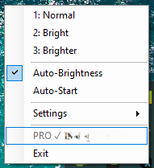

# BrightRaider

**See enemies in the dark. No alt-tab, no game files modified.**

BrightRaider is a lightweight Windows tray tool that lets you switch display brightness, contrast and digital vibrance with a single keypress. Built for Arc Raiders players who struggle with dark caves, shadows and low visibility — but works with any game.

One EXE, zero dependencies, 64 KB.

   

## Screenshots




## Demo Videos

> **Note on video quality:** BrightRaider works by adjusting display output at the GPU level — the same way your monitor brightness works. Because of this, screen recording software cannot capture the actual brightness changes. The videos were recorded with a phone camera pointed at the monitor, which is why the quality is lower than usual. This is also proof that BrightRaider is not a cheat — it only changes display settings, nothing inside the game.

**Free version** — Profile switching with Numpad keys (starts at 0:06):
[Watch: Free — Profile Switching](assets/videos/1%20bis%203.MOV)

**Pro version** — Auto-Brightness in action:
[Watch: Pro — Auto-Brightness](assets/videos/Por%20automatisch.MOV)

## Why BrightRaider?

NVIDIA Game Filters are blocked by anti-cheat (EAC). Monitor OSD is slow and clunky. Alt-tabbing to adjust settings gets you killed.

BrightRaider uses standard Windows display APIs — the same way your NVIDIA Control Panel or monitor settings work. **Safe with all anti-cheat systems** (EAC, BattlEye, Vanguard).

## Features

### Free
- **3 brightness profiles** — Normal, Bright, Brighter
- **Instant hotkey switching** — Numpad 1/2/3, works in fullscreen
- **Gamma + Contrast + Digital Vibrance** control
- **NVIDIA + AMD + Intel** support (GDI fallback for any GPU)
- **Multi-monitor** support
- **English / German** interface
- Portable — no installation, just one EXE

### Pro ($4.99)
- **Up to 9 profiles** with full customization
- **Auto-Brightness** — automatically adjusts based on screen content. Dark area? Brightness goes up. Step outside? Back to normal. Smooth transitions, no stutter.
- **Calibration Wizard** — two clicks to set up auto-brightness
- **Profile Editor** — fine-tune gamma, contrast, vibrance per profile
- **Game Mute** — mute only the game audio with Numpad 0
- **Auto-Start** with Windows

## Default Profiles

| Key | Name | Gamma | Contrast | Vibrance |
|-----|------|-------|----------|----------|
| Num 1 | Normal | 1.0 | 100% | 50% |
| Num 2 | Bright | 1.5 | 110% | 60% |
| Num 3 | Brighter | 2.0 | 110% | 70% |
| Num 4-9 | Custom [PRO] | Editable | Editable | Editable |

## Download

**[Download Latest Release](../../releases/latest)**

Just download `BrightRaider.exe` and run it. No installation needed.

## Quick Start

1. Run `BrightRaider.exe` — a tray icon appears
2. Press **Numpad 1** — Normal brightness
3. Press **Numpad 2** — Bright (better visibility in dark areas)
4. Press **Numpad 3** — Brighter (maximum visibility)
5. That's it. Switch anytime, even in fullscreen.

## First Launch

On first launch, BrightRaider sets one registry entry to unlock gamma adjustment:

```
HKLM\SOFTWARE\Microsoft\Windows NT\CurrentVersion\ICM → GdiIcmGammaRange = 256
```

This tells Windows to allow gamma adjustments — used by many display calibration tools, harmless, can be removed anytime. A UAC prompt appears once. **Restart your PC after the first launch** (only needed once).

## Pro Activation

1. **[Buy Pro License ($4.99)](https://brightraider.lemonsqueezy.com/checkout/buy/a7d69bd7-a83c-40d7-828d-01851f47d317)**
2. Right-click tray icon → **Settings** → **Enter License**
3. Enter your email and the license key from the purchase confirmation
4. Done — all Pro features unlocked permanently. No subscription, no internet required.

## Hotkeys

| Key | Action | Version |
|-----|--------|---------|
| Numpad 1-3 | Switch profile | Free |
| Numpad 4-9 | Switch profile | Pro |
| Numpad 0 | Mute/unmute game | Pro |

Works with NumLock on or off, with or without Shift.

## How It Works

BrightRaider adjusts your display output using standard Windows APIs:

- **GDI** (`SetDeviceGammaRamp`) — gamma & contrast, works on every GPU
- **NvAPI** — NVIDIA Digital Vibrance (hardware-level saturation)
- **ADL** — AMD Radeon saturation control

Nothing is modified in the game. Nothing is injected. It's the equivalent of changing your monitor brightness — just faster and with presets.

### Auto-Brightness (Pro)

Analyzes 5 small zones across your screen (center + 4 corners) using median brightness measurement. Based on the result, it smoothly interpolates between your profiles. Darker screen = more boost, brighter screen = less. The transition is seamless.

Calibrate in two steps: measure the darkest spot, measure the brightest spot, done.

## Anti-Cheat Safety

BrightRaider does **NOT**:
- Modify game files or memory
- Inject DLLs into game processes
- Hook into the game in any way
- Read game data

BrightRaider **ONLY** uses:
- Windows GDI — same as your monitor settings
- NVIDIA NvAPI — same as NVIDIA Control Panel
- AMD ADL — same as AMD Radeon Software

Anti-cheat systems do not flag display adjustments.

## System Requirements

- Windows 10 / 11
- .NET Framework 4.0 (pre-installed on every Windows)
- NVIDIA or AMD GPU recommended (Intel works with gamma-only)
- Numpad or numpad-emulating keyboard

## Build from Source

```cmd
C:\Windows\Microsoft.NET\Framework64\v4.0.30319\csc.exe /target:winexe /win32icon:Icon.ico /out:BrightRaider.exe BrightRaider.cs
```

Single file, no dependencies, no NuGet, no Visual Studio needed.

## Uninstall

1. Exit BrightRaider (right-click tray → Exit)
2. Delete the folder
3. Optional: Remove `GdiIcmGammaRange` from `HKLM\...\ICM`
4. Optional: Remove auto-start from `HKCU\SOFTWARE\Microsoft\Windows\CurrentVersion\Run`

## FAQ

**Does this work with other games?**
Yes. BrightRaider adjusts your display, not the game.

**Will I get banned?**
No. It uses the same Windows APIs as your monitor settings.

**Do I need Pro?**
Free is fully functional. Pro adds automatic switching so you never take your hand off the mouse.

---

Made for the Arc Raiders community.
