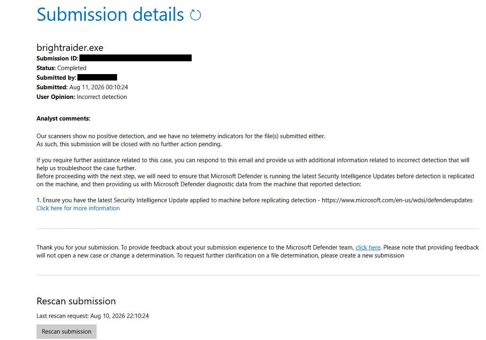

# BrightRaider

**See enemies in the dark. No alt-tab, no game files modified.**

BrightRaider is a lightweight Windows tray tool that lets you switch display brightness, contrast and digital vibrance with a single keypress — per game, auto-applied when you Alt-Tab. It works with **any** PC game; the Arc Raiders toolbox (Map Scanner, Autoscrapper, QuickSelect, QuickSave) is an **optional module** you switch on only if you want it.

One EXE, zero dependencies (Native AOT — no .NET runtime install required). Works with any keyboard — numpad, TKL, or fully custom bindings.

   
[](https://github.com/BrightRaider/BrightRaider/releases)

**🌐 Website: [brightraider.github.io/BrightRaider](https://brightraider.github.io/BrightRaider/)**

## 🆕 What's new

**V1.2 pre-release:** the **Autoscrapper** — [release notes](https://github.com/BrightRaider/BrightRaider/releases/tag/v1.2.0) · **Latest stable:** [V1.1.1](https://github.com/BrightRaider/BrightRaider/releases/latest) · [Changelog](docs/CHANGELOG_PUBLIC.txt)

## Before / After


## Screenshots

Two hero shots — the rest is one click away.

<table>
<tr>
  <td valign="top" width="40%">
    <strong>Tray menu</strong><br>
    Per-profile color marker, quick toggles for Alt-Tab Auto-Switch and Auto-Brightness, monitor picker, license status, one-click Settings.
    <br><br>
    
  </td>
  <td valign="top" width="60%">
    <strong>Map Scanner overlay — in-game</strong><br>
    Long-press M → ~100 % OCR hit rate, detects all 13 current map conditions, color-coded evac timers, audible alarm below threshold.
    <br><br>
    
  </td>
</tr>
</table>

<details>
<summary><b>📸 See every Settings tab</b> (click to expand — 10 screenshots)</summary>

<br>

**Game Profiles — the Free killer feature.** Per-game profile + FPS limit, auto-switched on Alt-Tab.


**Display + Profiles.** 9 profiles, each with Gamma / Contrast / Vibrance / Hue and an optional brightness range for Auto-Brightness.


**Auto-Brightness (Pro).** 5-zone screen sampling, Calibration Wizard, optional debug overlay.


**Audio (Pro).** Footstep Booster (per-process limiter), Audio Ducking, Background AutoMute.


**Map Scanner (Pro).** Per-state threshold colors, overlay position + background opacity, Evac alarm threshold.


**Crosshair (Pro).** Click-through overlay, 6 styles, custom color + outline.


**QuickSelect (Pro).** 8 slots, per-slot LMB hold time (ms), modifier-key bindings, MB3/4/5 + wheel triggers.


**QuickSave (Pro).** 5 drag presets, toggle direction, configurable timing.


**Hotkeys.** Every key reassignable. Modifier-key support (Ctrl / Alt / Shift). Mouse MB3/4/5 + scroll wheel.


**App + Performance.** Theme, language, license, Break reminder, display-reset emergency buttons. Performance tab: optional High priority + physical-cores-only affinity for the foreground game.


</details>

## Demo Videos

> **Note on video quality:** BrightRaider works by adjusting display output at the GPU level — the same way your monitor brightness works. Because of this, screen recording software cannot capture the actual brightness changes. The videos were recorded with a phone camera pointed at the monitor, which is why the quality is lower than usual. This is also proof that BrightRaider is not a cheat — it only changes display settings, nothing inside the game.

**Free version** — Profile switching with hotkeys (starts at 0:06):
[](https://youtu.be/ZjRZKfPi7Ok?t=6)

**Pro version** — Auto-Brightness in action:
[](https://youtu.be/q4DPRjHs24g?t=4)

## Why BrightRaider?

NVIDIA Game Filters are blocked by anti-cheat (EAC). Monitor OSD is slow and clunky. Alt-tabbing to adjust settings gets you killed.

BrightRaider's display and colour features use standard Windows display APIs — the same way your NVIDIA Control Panel or monitor settings work — and are **safe with all major anti-cheat systems** (EAC, BattlEye, Vanguard).

> **VibranceGUI is no longer needed.** BrightRaider auto-switches vibrance and FPS limits per game as you alt-tab — everything VibranceGUI does, in one place. You can uninstall it.

## Features

### Free
- **Display presets on a hotkey** — Normal / Bright / Brighter, instant even in fullscreen.
- **Game Profiles + Alt-Tab Auto-Switch** — per-game Gamma / Contrast / Vibrance / Hue and FPS limit, applied while the game is in front, reverted on Alt-Tab. Replaces VibranceGUI.
- **FPS limit per game** — NVIDIA via DRS, AMD via FRTC. → [Optimal FPS cap settings (Blur Busters)](https://blurbusters.com/gsync/gsync101-input-lag-tests-and-settings/)
- **HDR hotkey + per-game Auto-HDR** — HDR on when the game launches, off when it closes.
- **Hotkeys your way** — every key rebindable, with modifiers, mouse buttons and scroll wheel; optionally only while a game is focused. Controller players: see [the manual](docs/Manual.md#playing-with-a-controller).
- **Your calibration stays safe** — DisplayCAL / ICC gamma is saved on first launch and restored on exit, even after a crash.
- **NVIDIA, AMD and Intel** · multi-monitor · English / German · dark mode
- **Break reminder, update notifier, auto-start with Windows**
- **Native AOT** — one portable EXE, no .NET install.

### Pro (€5.49)
One key unlocks everything below, in every game — the Arc Raiders tools included.

#### For every game

- **Auto-Brightness** — samples the screen and adjusts Gamma / Contrast / Vibrance to what you see; set up in two clicks. 📖 [Guide](docs/AutoBrightness_Guide.md)
- **Profile editor + profiles 4–9** — edit Gamma / Contrast / Vibrance / Hue of every preset.
- **Footstep Booster** — per-game audio limiter: turn the game up for footsteps without gunshots blowing your ears. 📖 [Guide](docs/FootstepBooster_Guide.md)
- **Game Mute, Audio Ducking, Background AutoMute** — silence or duck only the game; muted automatically on Alt-Tab. Discord and music keep playing.
- **Audio Output Switcher** — cycle speakers ↔ headphones with one key, optionally on game start.
- **Autorun** — CapsLock holds forward; tap mode for the Looting Mk. 3 augment.
- **Crosshair Overlay** — click-through, 6 styles, custom colour, outline and size.
- **Process Optimizer** — High priority and physical cores only for the game in front.

#### Arc Raiders module

Part of the optional Arc Raiders module — switch it on in the Setup Wizard or *Settings → App*.

- **Autoscrapper** *(V1.2 pre-release)* — press F5 with the stash open: it reads the whole stash and scraps or sells by your rules, only after you confirm the list. 📖 [Guide](docs/Autoscrapper_Guide.md)
- **Map Scanner** — long-press M on the map: evac timers, map conditions and hatch states as a colour-coded overlay, plus an evac alarm. Other games via data packs. 📖 [Guide](docs/MapScanner_Guide.md) · [Pack authoring](docs/pack-authoring.md)
- **QuickSelect** — one key uses an item from your quick-use wheel. 📖 [Guide](docs/QuickSelect_Guide.md)
- **QuickSave** — one key drags an item into your Safe Pocket or backpack and back. 📖 [Guide](docs/QuickSave_Guide.md)

## Default Profiles

| Key (default) | Name | Gamma | Contrast | Vibrance |
|---------------|------|-------|----------|----------|
| Num 1 | Normal | 1.0 | 100% | 50% |
| Num 2 | Bright | 1.5 | 110% | 60% |
| Num 3 | Brighter | 2.0 | 110% | 70% |
| Num 4–9 | Custom [PRO] | Editable | Editable | Editable |

All hotkeys are rebindable. Defaults shown above use the numpad preset. On Free these three presets are **switch-only** — editing any display profile's values (and unlocking 4–9) is Pro. For fully custom colors per game, use the free **Game Profiles** tab.

## Download

**[Download Latest Release](../../releases/latest)**

One `BrightRaider.exe` for every keyboard — numpad, TKL or custom. A short setup wizard appears on first launch: choose your keyboard type (numpad or TKL) and your hotkeys are configured automatically. You can re-run the wizard at any time from Settings → Input.

> **Coming from V9.x?** Your license key still works — re-enter it once under *Settings → App*. Activation limit reached? See the [known-issues post](https://github.com/BrightRaider/BrightRaider/issues/74).

Just download and run. No installation needed.

> ⚠️ **Antivirus false positive?** Some AV tools flag BrightRaider due to its global keyboard hook (same mechanism as Logitech GHub, Razer Synapse, Discord Push-to-Talk). No data is logged or transmitted. **Verify it yourself:** [VirusTotal scan of the current build](https://www.virustotal.com/gui/file/5b4332a38b3ca225a7d142df9f8eee8f8d807236737a05c8ba7067180d78e3f8) — only a couple of the ~68 engines flag it heuristically. This build was also submitted to **Microsoft** for analysis (11 Aug 2026); their scanners reported *"no positive detection"*. 100–200 downloads daily, zero reports — [see stats](https://github-release-stats.ghostbyte.dev/BrightRaider/BrightRaider).

<details>
<summary>📄 <b>Microsoft's analysis of this exact build</b> (click to expand)</summary>

<br>



<sub>Submitted 11 August 2026 through the <a href="https://www.microsoft.com/en-us/wdsi/filesubmission">Microsoft Security Intelligence file submission portal</a>, and closed as <b>Completed</b> with no detection. Submission ID and submitter address redacted. The two releases before this one (V1.1.0 and V1.0.0) were submitted the same way and came back the same.</sub>

</details>

## Quick Start

1. Run `BrightRaider.exe` — a setup wizard appears
2. Choose your keyboard type (numpad or TKL) — defaults are configured automatically
3. Decide whether you want the **Arc Raiders module** (Map Scanner, QuickSelect, QuickSave, Autorun). Off by default on a fresh install — you can flip it any time in *Settings → App*.
4. Press your profile key — switch brightness instantly, even in fullscreen
5. That's it. Switch anytime.

## First Launch

On first launch, BrightRaider sets one registry entry to unlock gamma adjustment:

```
HKLM\SOFTWARE\Microsoft\Windows NT\CurrentVersion\ICM → GdiIcmGammaRange = 256
```

This tells Windows to allow gamma adjustments — used by many display calibration tools, harmless, can be removed anytime. A UAC prompt appears once. **Restart your PC after the first launch** (only needed once).

## Pro Activation

1. Buy your license:
   - **[Lemon Squeezy (€5.49)](https://brightraider.lemonsqueezy.com/checkout/buy/9b93d8c0-262f-43a4-bd41-167557efb156)**
2. Right-click tray icon → **Settings** → **Enter License**
3. Enter your email and license key
4. Done — all Pro features unlocked permanently. No subscription. Internet required once for activation, offline forever after.

## Hotkeys (default)

> All hotkeys are fully rebindable in **Settings → Input**.

| Numpad (default) | TKL (default) | Action | Version |
|------------------|---------------|--------|---------|
| Numpad 1–3 | ← ↓ → | Switch profile | Free |
| Numpad 4–9 | — | Switch profile (4–9) | Pro |
| Numpad 0 (short) | ↑ (short) | Mute/unmute game | Pro |
| Numpad 0 (hold 600ms) | ↑ (hold 600ms) | Audio Ducking on/off | Pro |
| Numpad + | Insert | Toggle crosshair | Pro |
| Numpad * | Delete | Toggle timer overlay | Pro |
| Numpad − | Home | Toggle QuickSelect on/off | Pro |
| Numpad / | End | Toggle QuickSave on/off | Pro |
| Numpad Del | Page Down | Toggle ALL hotkeys on/off | Pro |
| Numpad Enter | Page Up | Cycle audio output device | Pro |
| CapsLock | CapsLock | Toggle autorun | Pro |
| M (hold on map) | M (hold on map) | Scan evacuation timers | Pro |

Works with NumLock on or off. **Tip: keep NumLock off while playing** — with NumLock on, Windows briefly interrupts the Shift key when you switch profiles, which can slow your character if Shift is your sprint key.

## How It Works

BrightRaider adjusts your display output using standard Windows APIs:

- **GDI** (`SetDeviceGammaRamp`) — gamma & contrast, works on every GPU
- **NvAPI** — NVIDIA Digital Vibrance; per-game FPS limits via NvAPI DRS
- **ADL** — AMD Radeon saturation + hue control
- **ADLX** — AMD per-game FPS limits via ADLX FRTC

Nothing is modified in the game. Nothing is injected. It's the equivalent of changing your monitor brightness — just faster and with presets.

### Auto-Brightness (Pro)

Analyzes 5 small zones across your screen (center + 4 corners) using median brightness measurement. Based on the result, it smoothly interpolates between your profiles. Darker screen = more boost, brighter screen = less. The transition is seamless.

Calibrate in two steps: measure the darkest spot, measure the brightest spot, done.

## Anti-Cheat Safety

BrightRaider does **NOT**:
- Modify game files or memory
- Inject DLLs into game processes
- Hook into the game
- Read game data or game memory

The Map Scanner takes a **screenshot of your screen** and reads it on your PC — the same as taking a photo of your monitor. No game files, no game memory, no game process is accessed.

BrightRaider **ONLY** uses:
- Windows GDI — same as your monitor settings
- NVIDIA NvAPI — same as NVIDIA Control Panel
- AMD ADL / ADLX — same as AMD Radeon Software

Anti-cheat systems do not flag display adjustments.

### Input Automation

**Autorun** just holds your forward key down — a comfort feature, the same as the auto-run key many games include natively or a keyboard's own key-hold. It's a single held keypress with no timing pattern or sequence to it, effectively indistinguishable from holding the key yourself.

**QuickSave** and **QuickSelect** are the part to be aware of: they send a short sequence of clicks/keystrokes to move an item, so they're not in the "display only" category. BrightRaider does this with **no kernel driver and no injection** — but automated multi-step input is something behavioural anti-cheat (such as Anybrain, now used by Arc Raiders) can in principle flag, like any input-automation tool. The strongest thing such detection keys on is *simulated mouse movement*, so keyboard-only selection is a weaker signal than anything that moves the cursor for you. Both are **optional and off by default** — if you want zero exposure, leave them off and use everything else: display, FPS, overlay, Map Scanner and Autorun all stay clear of that category.

### Crosshair Overlay

BrightRaider's crosshair works via a transparent Windows overlay — the exact same mechanism used by Discord, GeForce Experience, and TeamSpeak overlays.

EAC (Easy Anti-Cheat) **explicitly allows** this type of overlay. It is not injected into the game, does not read game memory, and is not rendered inside the game engine. It is simply a transparent window drawn on top by Windows.

EAC agrees in practice, not only on paper: overlay crosshairs that EAC does block stop Arc Raiders from launching at all, and BrightRaider's does not.

**That statement is about EAC specifically and does not carry over to other anti-cheats.** VAC is a separate system with its own tolerances, and players report bans connected to third-party crosshair overlays. **In Counter-Strike, leave the crosshair off.** Nothing else is affected — display, audio and movement stay clear of this question entirely.

## System Requirements

- Windows 10 / 11 (x64)
- **No .NET runtime install required** — Native AOT, single self-contained EXE
- NVIDIA or AMD GPU recommended for full feature set (Vibrance, Hue, FPS limit). Intel + integrated GPUs work with Gamma + Contrast only.

## Changelog

**[View full changelog](docs/CHANGELOG_PUBLIC.txt)**

## Manual

**📘 [Full Manual](docs/Manual.md)** — English + German, every feature explained.

## Guides

Deep-dives for the more advanced features:

- 🧹 **[Autoscrapper Guide](docs/Autoscrapper_Guide.md)** — rules, the review screen, test run vs. live, naming unrecognised tiles
- 🗺️ **[Map Scanner Guide](docs/MapScanner_Guide.md)** — supported maps, event detection (all 13 conditions), threshold colors, Evac alarm setup
- 🔆 **[Auto-Brightness Guide](docs/AutoBrightness_Guide.md)** — how the 5-zone sampler works, Calibration Wizard walkthrough, zone-weight tuning, debug overlay
- 🔊 **[Footstep Booster Guide](docs/FootstepBooster_Guide.md)** — threshold / attack / release tuning, recommended starting values, troubleshooting
- ⚡ **[QuickSelect Guide](docs/QuickSelect_Guide.md)** — per-slot LMB hold time, modifier-key bindings, slots 7–10 mouse-movement path
- 💾 **[QuickSave Guide](docs/QuickSave_Guide.md)** — 5 drag presets, toggle direction, timing controls

## Uninstall

1. Exit BrightRaider (right-click tray → Exit)
2. Delete the folder
3. Optional: Remove `GdiIcmGammaRange` from `HKLM\...\ICM`
4. Optional: Remove auto-start from `HKCU\SOFTWARE\Microsoft\Windows\CurrentVersion\Run`

## Feedback & Issues

Found a bug or have an idea? [Open an issue](https://github.com/BrightRaider/BrightRaider/issues/new/choose).

> This is a solo hobby project maintained in my free time. I read everything, but response times vary — there is no support contract.

## FAQ

**Does this work with other games?**
Yes. BrightRaider adjusts your display, not the game.

**Will I get banned?**
The display, colour, FPS and overlay features use the same Windows display APIs as your monitor settings — nothing injected, hooked, or read from the game — so they're anti-cheat-safe. The optional input-automation features (QuickSave / QuickSelect / Autorun) send keystrokes to the game, which is a different category; in titles with behavioural anti-cheat (e.g. Arc Raiders' Anybrain) use those at your own discretion.

**Do I need Pro?**
Free is fully functional. Pro adds QuickSave (drag to Safe Pocket with one key), QuickSelect (auto-use items), auto-brightness, map scanner, and more — so you never take your hand off the mouse.

**I used VibranceGUI before. Do I still need it?**
No. BrightRaider replaces it completely. Set your vibrance per game in Settings → Alt-Tab, and BrightRaider handles switching automatically.

**I play with a controller. Does BrightRaider work?**
The display side works with no setup at all — profiles, per-game colour, FPS limit and HDR switch on their own when the game comes to the front, and none of that involves a hotkey. That's the larger half of BrightRaider and it doesn't care what you hold.

The hotkey features (QuickSave, QuickSelect, Autorun) can't be bound to a controller button. BrightRaider listens on the Windows keyboard and mouse hooks, and those never see gamepad input — a controller talks to Windows through a separate channel. It also needs to *swallow* the trigger key so the game doesn't also act on it, which polling a gamepad cannot do: the button would fire your macro **and** its normal in-game action.

A remapper solves it properly: **Steam Input**, **DS4Windows** or **reWASD** consume the controller button and send a keyboard key instead. BrightRaider then sees an ordinary key, swallowing included. Full details in the [manual](docs/Manual.md).

---

<details>
<summary><strong>Deutsche Version</strong></summary>

## BrightRaider

**Feinde im Dunkeln sehen. Kein Alt-Tab, keine Spieldateien verändert.**

BrightRaider ist ein schlankes Windows-Tray-Tool, mit dem du Helligkeit, Kontrast und Digital Vibrance per Tastendruck umschalten kannst — pro Spiel, automatisch beim Alt-Tab. Es funktioniert mit **jedem** PC-Spiel; die Arc-Raiders-Werkzeuge (Map Scanner, Autoscrapper, QuickSelect, QuickSave) sind ein **optionales Modul**, das du nur bei Bedarf einschaltest.

Eine EXE, keine Abhängigkeiten (Native AOT — keine .NET-Runtime-Installation nötig). Funktioniert mit jeder Tastatur — Numpad, TKL oder komplett selbst belegt.

## 🆕 Neu

**V1.2 Pre-release:** der **Autoscrapper** — [Release Notes](https://github.com/BrightRaider/BrightRaider/releases/tag/v1.2.0) · **Aktuelle stabile Version:** [V1.1.1](https://github.com/BrightRaider/BrightRaider/releases/latest) · [Changelog](docs/CHANGELOG_PUBLIC.txt)

## Warum BrightRaider?

NVIDIA Game Filter werden vom Anti-Cheat (EAC) blockiert. Das Monitor-OSD ist langsam und umständlich. Alt-Tab zum Einstellen bringt dich um.

BrightRaiders Anzeige- und Farbfunktionen nutzen Standard-Windows-Display-APIs — genau wie dein NVIDIA Control Panel oder deine Monitor-Einstellungen — und sind **sicher mit allen großen Anti-Cheat-Systemen** (EAC, BattlEye, Vanguard).

> **VibranceGUI wird nicht mehr benötigt.** BrightRaider schaltet Vibrance und FPS-Limit automatisch pro Spiel beim Alt-Tab — alles was VibranceGUI macht, an einem Ort. Du kannst es deinstallieren.

## Features

### Free
- **Helligkeitsprofile per Hotkey** — Normal / Hell / Heller, sofort, auch im Vollbild.
- **Spielprofile + Alt-Tab-Automatik** — Gamma / Kontrast / Vibrance / Hue und FPS-Limit pro Spiel, aktiv solange das Spiel vorne ist, beim Alt-Tab zurückgesetzt. Ersetzt VibranceGUI.
- **FPS-Limit pro Spiel** — NVIDIA über DRS, AMD über FRTC. → [Optimale FPS-Cap-Einstellungen (Blur Busters)](https://blurbusters.com/gsync/gsync101-input-lag-tests-and-settings/)
- **HDR per Hotkey + Auto-HDR pro Spiel** — HDR an beim Spielstart, aus beim Beenden.
- **Hotkeys nach Wunsch** — jede Taste frei belegbar, mit Modifikatoren, Maustasten und Mausrad; auf Wunsch nur, solange ein Spiel im Fokus ist.
- **Deine Kalibrierung bleibt erhalten** — DisplayCAL-/ICC-Gamma wird beim ersten Start gesichert und beim Beenden wiederhergestellt, auch nach einem Absturz.
- **NVIDIA, AMD und Intel** · Multi-Monitor · Deutsch / Englisch · Dark Mode
- **Pausen-Erinnerung, Update-Hinweis, Autostart mit Windows**
- **Native AOT** — eine portable EXE, keine .NET-Installation.

### Pro (5,49 €)
Ein Schlüssel schaltet alles unten frei, in jedem Spiel — die Arc-Raiders-Werkzeuge eingeschlossen.

#### Für jedes Spiel

- **Auto-Helligkeit** — misst den Bildschirm und passt Gamma / Kontrast / Vibrance an das an, was du siehst; eingerichtet in zwei Klicks. 📖 [Anleitung (EN)](docs/AutoBrightness_Guide.md)
- **Profil-Editor + Profile 4–9** — Gamma / Kontrast / Vibrance / Hue jedes Profils anpassen.
- **Footstep Booster** — Audio-Limiter nur fürs Spiel: laut genug für Schritte, ohne dass Schüsse zu laut werden. 📖 [Anleitung (EN)](docs/FootstepBooster_Guide.md)
- **Game Mute, Audio Ducking, Background-AutoMute** — nur das Spiel stumm oder leiser; beim Alt-Tab automatisch stumm. Discord und Musik laufen weiter.
- **Audio-Ausgabe-Switcher** — Boxen ↔ Kopfhörer per Taste, auf Wunsch automatisch beim Spielstart.
- **Autorun** — CapsLock hält die Vorwärtstaste; Tap-Modus für das Looting-Mk.-3-Augment.
- **Crosshair-Overlay** — click-through, 6 Stile, Farbe, Umriss und Größe frei wählbar.
- **Process Optimizer** — hohe Priorität und nur physische Kerne für das Spiel im Vordergrund.

#### Arc-Raiders-Modul

Teil des optionalen Arc-Raiders-Moduls — einschalten im Einrichtungsassistenten oder unter *Einstellungen → App*.

- **Autoscrapper** *(V1.2 Pre-release)* — F5 bei offenem Lager: liest das ganze Lager und verschrottet oder verkauft nach deinen Regeln, erst nachdem du die Liste bestätigt hast. 📖 [Anleitung (EN)](docs/Autoscrapper_Guide.md)
- **Map Scanner** — M auf der Karte gedrückt halten: Evac-Timer, Kartenereignisse und Luken als farbiges Overlay, dazu ein Evac-Alarm. Andere Spiele per Datenpack. 📖 [Anleitung (EN)](docs/MapScanner_Guide.md) · [Datenpacks](docs/pack-authoring.md)
- **QuickSelect** — eine Taste benutzt ein Item aus dem Schnellrad. 📖 [Anleitung (EN)](docs/QuickSelect_Guide.md)
- **QuickSave** — eine Taste zieht ein Item in die Sicherheitstasche oder den Rucksack und zurück. 📖 [Anleitung (EN)](docs/QuickSave_Guide.md)

## Download

**[Neueste Version herunterladen](../../releases/latest)**

Eine `BrightRaider.exe` für jede Tastatur — Numpad, TKL oder eigene Belegung. Beim ersten Start erscheint ein kurzer Einrichtungsassistent: Tastaturtyp wählen, Hotkeys werden automatisch gesetzt. Jederzeit neu starten über Einstellungen → Input.

## Tastenbelegung (Standard)

> Alle Hotkeys sind in **Einstellungen → Input** vollständig belegbar.

| Numpad (Standard) | TKL (Standard) | Aktion | Version |
|-------------------|----------------|--------|---------|
| Numpad 1–3 | ← ↓ → | Profil wechseln | Free |
| Numpad 4–9 | — | Profil wechseln (4–9) | Pro |
| Numpad 0 (kurz) | ↑ (kurz) | Spiel stumm/laut | Pro |
| Numpad 0 (600ms) | ↑ (600ms) | Audio Ducking an/aus | Pro |
| Numpad + | Einfg | Fadenkreuz an/aus | Pro |
| Numpad * | Entf | Timer-Overlay an/aus | Pro |
| Numpad − | Pos1 | QuickSelect an/aus | Pro |
| Numpad / | Ende | QuickSave an/aus | Pro |
| Numpad Entf | Bild↓ | ALLE Hotkeys an/aus | Pro |
| Numpad Enter | Bild↑ | Audio-Ausgabegerät umschalten | Pro |
| CapsLock | CapsLock | Autorun an/aus | Pro |
| M (halten auf Karte) | M (halten auf Karte) | Evakuierungs-Timer scannen | Pro |

## Anti-Cheat Sicherheit

BrightRaider verändert **KEINE** Spieldateien oder den Spielspeicher. Der Map Scanner macht einen Screenshot und liest ihn lokal auf deinem PC aus. Keine Injektion, kein Spielzugriff.

BrightRaider nutzt **NUR** Standard-Windows-APIs (GDI, NvAPI, ADL/ADLX) — wie das NVIDIA Control Panel oder AMD Radeon Software.

**Autorun** hält einfach deine Vorwärtstaste gedrückt — eine Komfort-Funktion, wie die Auto-Run-Taste, die viele Spiele nativ haben, oder die Tastenhalte-Funktion mancher Tastaturen. Ein einzelner gehaltener Tastendruck, ohne Timing-Muster oder Sequenz — praktisch nicht davon zu unterscheiden, dass du die Taste selbst hältst.

**QuickSave und QuickSelect** sind der Teil, den man kennen sollte: Sie senden eine kurze Folge von Klicks/Tastendrücken, um ein Item zu bewegen, und sind damit eine andere Kategorie als die Anzeige-Funktionen oben. BrightRaider macht das **ohne Kernel-Treiber und ohne Injektion** — automatisierte mehrstufige Eingaben können von verhaltensbasiertem Anti-Cheat (z. B. Anybrain, jetzt in Arc Raiders) aber grundsätzlich erkannt werden, wie bei jedem Eingabe-Automatisierungs-Tool. Das stärkste Signal für solche Systeme ist *simulierte Mausbewegung* — reine Tastatur-Auswahl ist daher ein schwächeres Signal als alles, was den Cursor für dich bewegt. Beide sind **optional und standardmäßig aus** — wer kein Risiko eingehen will, lässt sie aus und nutzt alles andere: Anzeige, FPS, Overlay, Map Scanner und Autorun bleiben außerhalb dieser Kategorie.

**Crosshair-Overlay:** ein transparentes Windows-Fenster, dieselbe Technik wie bei Discord- oder GeForce-Overlays — nicht injiziert, kein Speicherzugriff, nicht in der Engine gerendert. EAC erlaubt das ausdrücklich. **Diese Aussage gilt für EAC und lässt sich nicht auf andere Anti-Cheats übertragen** — VAC ist ein eigenes System, und aus der Counter-Strike-Szene werden Sperren im Zusammenhang mit fremden Crosshair-Overlays berichtet. **In Counter-Strike den Crosshair auslassen.**

## FAQ

**Funktioniert das auch mit anderen Spielen?**
Ja. BrightRaider passt den Bildschirm an, nicht das Spiel.

**Werde ich gebannt?**
Die Anzeige-, Farb-, FPS- und Overlay-Funktionen nutzen die gleichen Windows-Display-APIs wie deine Monitor-Einstellungen — nichts wird injiziert, gehookt oder aus dem Spiel gelesen — sie sind also anti-cheat-sicher. Die optionalen Eingabe-Automatisierungs-Funktionen (QuickSave / QuickSelect / Autorun) senden Tastendrücke ans Spiel, das ist eine andere Kategorie; in Titeln mit verhaltensbasiertem Anti-Cheat (z. B. Arc Raiders' Anybrain) nutze diese nach eigenem Ermessen.

**Brauche ich Pro?**
Free ist voll funktionsfähig. Pro fügt QuickSave, QuickSelect, Auto-Helligkeit, Map Scanner und mehr hinzu.

**Ich hatte VibranceGUI. Brauche ich das noch?**
Nein. BrightRaider ersetzt es vollständig. Vibrance und FPS-Limit pro Spiel in Einstellungen → Alt-Tab einstellen, BrightRaider übernimmt den Rest.

**Ich spiele mit Controller. Funktioniert BrightRaider?**
Die Anzeigeseite funktioniert ganz ohne Einrichtung — Profile, Farben pro Spiel, FPS-Limit und HDR schalten von selbst um, sobald das Spiel in den Vordergrund kommt. Dafür braucht es keinen Hotkey. Das ist der größere Teil von BrightRaider, und ihm ist egal, was du in der Hand hältst.

Die Hotkey-Funktionen (QuickSave, QuickSelect, Autorun) lassen sich nicht auf eine Controller-Taste legen. BrightRaider lauscht an den Windows-Hooks für Tastatur und Maus, und die sehen Gamepad-Eingaben grundsätzlich nicht — ein Controller spricht über einen getrennten Kanal mit Windows. Dazu kommt: Die Auslösetaste muss **geschluckt** werden, damit das Spiel sie nicht ebenfalls verarbeitet. Beim Abfragen eines Gamepads geht das nicht — die Taste würde dein Makro auslösen **und** ihre normale Spielfunktion.

Sauber lösen lässt es sich mit einem Remapper: **Steam Input**, **DS4Windows** oder **reWASD** fangen die Controller-Taste ab und senden eine Tastatureingabe. BrightRaider sieht dann eine normale Taste — inklusive Schlucken. Ausführlich im [Handbuch](docs/Manual.md).

</details>

---

Made for the Arc Raiders community.
