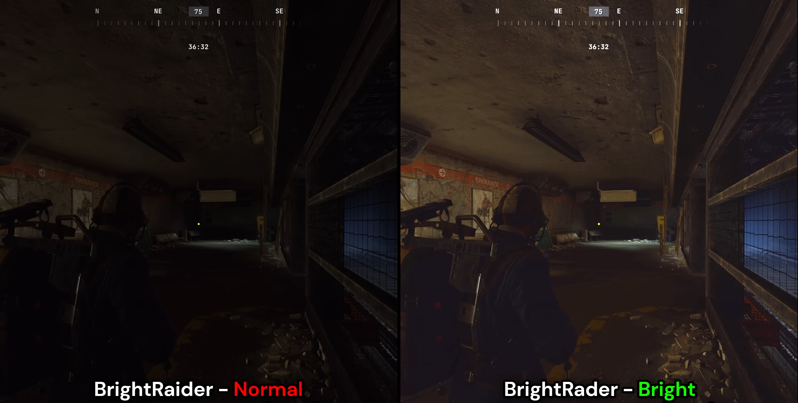
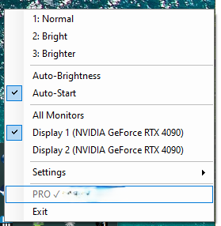
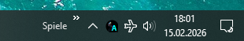
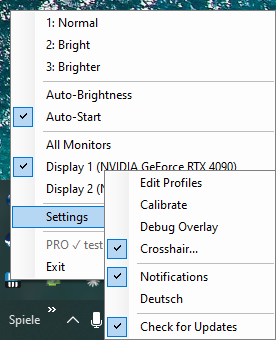

# BrightRaider

**See enemies in the dark. No alt-tab, no game files modified.**

BrightRaider is a lightweight Windows tray tool that lets you switch display brightness, contrast and digital vibrance with a single keypress. Built for Arc Raiders players who struggle with dark caves, shadows and low visibility — but works with any game.

One EXE, zero dependencies, ~140 KB.

   
[](https://github.com/BrightRaider/BrightRaider/releases)

## Before / After



*Screenshot courtesy of [Jags95](https://www.youtube.com/watch?v=XX_tYYqnB7w)*

## Screenshots

| | | |
|---|---|---|
|  |  |  |

**Map Scanner — live evacuation timer overlay (Pro):**


## Demo Videos

> **Note on video quality:** BrightRaider works by adjusting display output at the GPU level — the same way your monitor brightness works. Because of this, screen recording software cannot capture the actual brightness changes. The videos were recorded with a phone camera pointed at the monitor, which is why the quality is lower than usual. This is also proof that BrightRaider is not a cheat — it only changes display settings, nothing inside the game.

**Free version** — Profile switching with Numpad keys (starts at 0:06):
[](https://youtu.be/ZjRZKfPi7Ok?t=6)

**Pro version** — Auto-Brightness in action:
[](https://youtu.be/q4DPRjHs24g?t=4)

## Why BrightRaider?

NVIDIA Game Filters are blocked by anti-cheat (EAC). Monitor OSD is slow and clunky. Alt-tabbing to adjust settings gets you killed.

BrightRaider uses standard Windows display APIs — the same way your NVIDIA Control Panel or monitor settings work. **Safe with all anti-cheat systems** (EAC, BattlEye, Vanguard).

> ⚠️ **Antivirus false positive?** Some AV tools flag BrightRaider due to its global keyboard hook (same mechanism as Logitech GHub, Razer Synapse, Discord Push-to-Talk). No data is logged or transmitted. 100–200 downloads daily, zero reports — [see stats](https://github-release-stats.ghostbyte.dev/BrightRaider/BrightRaider).

## Features

### Free
- **3 brightness profiles** — Normal, Bright, Brighter
- **Instant hotkey switching** — Numpad 1/2/3, works in fullscreen
- **Gamma + Contrast + Digital Vibrance** control
- **NVIDIA + AMD + Intel** support (GDI fallback for any GPU)
- **Multi-monitor** support
- **English / German** interface
- **Break Reminder** — shows an orange reminder toast after a configurable interval (default: 45 min). Configure under Settings → Break Reminder. Does not interrupt gameplay.
- **Auto-Start with Windows**
- Portable — no installation, just one EXE

### Pro (€5.49)
- **QuickSelect** — press a single key to automatically use an item from your quick-use wheel. Handles everything: hold Q → select slot → release Q → hold LMB → press H. 5 independent slots, 6 LMB timer presets (Adrenalin Syringe, Bandage, Shield Charger…), Q and H keys freely rebindable. Toggle with Numpad− or Pos1. 📖 [Setup Guide](docs/QuickSelect_Guide.md)
- **Auto-Brightness** — automatically adjusts based on screen content. Dark area? Brightness goes up. Step outside? Back to normal. Smooth transitions, no stutter. Zone weights configurable (Settings → Zones...) — reduce corner influence if your HUD covers them.
- **Map Scanner** — hold M on the map to automatically read all evacuation timers. Takes a screenshot, reads the timers via Windows built-in OCR (no game files or memory touched), and shows a live color-coded countdown overlay on screen. Supports Buried City, Stella Montis, Space Port, Blue Gate and Damm. No extra software needed. Works reliably in most situations — if a scan misses, just hold M again.
- **Evac Alarm** — get a red toast + sound alert when an evac timer drops below your configured threshold (set in minutes + seconds). Configure inside Settings → Map Scanner → Settings.
- **Autorun** — short press CapsLock to hold W (walk or sprint). Hold CapsLock 600ms for **Tap Mode** — pulses W at intervals, perfect for the **Looting Mk. 3 (Survivor)** augment (keeps health at 75% while moving). Shift toggles sprint. C triggers a slide. CapsLock/W/S/C stops. Rebind in Settings.
- **Crosshair Overlay** — A clean, click-through crosshair directly on your screen. Choose from 4 styles (Cross, Dot+Ring, T-Shape, Dot), pick any color and size. Toggle with Numpad+ or Insert. EAC-safe — same mechanism as Discord and GeForce Experience overlays.
- **Audio Ducking** — hold Numpad 0 (or ↑) for 600ms to duck game audio to 20%. Short press still mutes/unmutes. Configure volume and hold duration in Settings.
- **Game Mute** — mute only the game audio with a single key (Numpad 0). Your Discord, music, everything else stays on. One press to focus, one press to hear the game again. Works instantly, even in fullscreen.
- **Up to 9 profiles** with full customization
- **Calibration Wizard** — two clicks to set up auto-brightness
- **Profile Editor** — fine-tune gamma, contrast, vibrance per profile

## Default Profiles

| Key | Name | Gamma | Contrast | Vibrance |
|-----|------|-------|----------|----------|
| Num 1 | Normal | 1.0 | 100% | 50% |
| Num 2 | Bright | 1.5 | 110% | 60% |
| Num 3 | Brighter | 2.0 | 110% | 70% |
| Num 4-9 | Custom [PRO] | Editable | Editable | Editable |

## Download

**[Download Latest Release](../../releases/latest)**

| File | Controls | For |
|------|----------|-----|
| `BrightRaider.exe` | Numpad 1-9, Numpad 0 | Standard keyboards with numpad |
| `BrightRaider_Arrows.exe` | Arrow keys | Laptops & TKL keyboards without numpad |

Just download and run. No installation needed.

## Quick Start

1. Run `BrightRaider.exe` — a tray icon appears
2. Press **Numpad 1** — Normal brightness
3. Press **Numpad 2** — Bright (better visibility in dark areas)
4. Press **Numpad 3** — Brighter (maximum visibility)
5. That's it. Switch anytime, even in fullscreen.

## First Launch

On first launch, BrightRaider sets one registry entry to unlock gamma adjustment:

```
HKLM\SOFTWARE\Microsoft\Windows NT\CurrentVersion\ICM → GdiIcmGammaRange = 256
```

This tells Windows to allow gamma adjustments — used by many display calibration tools, harmless, can be removed anytime. A UAC prompt appears once. **Restart your PC after the first launch** (only needed once).

## Pro Activation

1. Buy your license:
   - **[Lemon Squeezy (€5.49)](https://brightraider.lemonsqueezy.com/checkout/buy/9b93d8c0-262f-43a4-bd41-167557efb156)**
2. Right-click tray icon → **Settings** → **Enter License**
3. Enter your email and license key
4. Done — all Pro features unlocked permanently. No subscription. Internet required once for activation, offline forever after.

## Hotkeys

### Numpad version (`BrightRaider.exe`)

| Key | Action | Version |
|-----|--------|---------|
| Numpad 1-3 | Switch profile | Free |
| Numpad 4-9 | Switch profile | Pro |
| Numpad 0 (short) | Mute/unmute game | Pro |
| Numpad 0 (hold 600ms) | Audio Ducking on/off | Pro |
| Numpad + | Toggle crosshair | Pro |
| Numpad * | Toggle timer overlay | Pro |
| Numpad − | Toggle QuickSelect on/off | Pro |
| 4 / 5 / 6 | QuickSelect slot 1/2/3 | Pro |
| CapsLock | Toggle autorun | Pro |
| M (hold on map) | Scan evacuation timers | Pro |

Works with NumLock on or off. **Tip: keep NumLock off while playing** — with NumLock on, Windows briefly interrupts the Shift key when you switch profiles, which can slow your character if Shift is your sprint key.

### Arrow Keys version (`BrightRaider_Arrows.exe`)

| Key | Action | Version |
|-----|--------|---------|
| Arrow Left | Profile 1 (Normal) | Free |
| Arrow Down | Profile 2 (Bright) | Free |
| Arrow Right | Profile 3 (Brighter) | Free |
| Arrow Up (short) | Mute/unmute game | Pro |
| Arrow Up (hold 600ms) | Audio Ducking on/off | Pro |
| Insert | Toggle crosshair | Pro |
| Delete / Entf | Toggle timer overlay | Pro |
| Pos1 / Home | Toggle QuickSelect on/off | Pro |
| 4 / 5 / 6 | QuickSelect slot 1/2/3 | Pro |
| CapsLock | Toggle autorun | Pro |
| M (hold on map) | Scan evacuation timers | Pro |

## How It Works

BrightRaider adjusts your display output using standard Windows APIs:

- **GDI** (`SetDeviceGammaRamp`) — gamma & contrast, works on every GPU
- **NvAPI** — NVIDIA Digital Vibrance (hardware-level saturation)
- **ADL** — AMD Radeon saturation control

Nothing is modified in the game. Nothing is injected. It's the equivalent of changing your monitor brightness — just faster and with presets.

### Auto-Brightness (Pro)

Analyzes 5 small zones across your screen (center + 4 corners) using median brightness measurement. Based on the result, it smoothly interpolates between your profiles. Darker screen = more boost, brighter screen = less. The transition is seamless.

Calibrate in two steps: measure the darkest spot, measure the brightest spot, done.

## Anti-Cheat Safety

BrightRaider does **NOT**:
- Modify game files or memory
- Inject DLLs into game processes
- Hook into the game in any way
- Read game data or game memory

The Map Scanner takes a **screenshot of your screen** and reads it with Windows built-in OCR — the same as taking a photo of your monitor. No game files, no game memory, no game process is accessed.

BrightRaider **ONLY** uses:
- Windows GDI — same as your monitor settings
- NVIDIA NvAPI — same as NVIDIA Control Panel
- AMD ADL — same as AMD Radeon Software

Anti-cheat systems do not flag display adjustments.

### Crosshair Overlay

BrightRaider's crosshair works via a transparent Windows overlay — the exact same mechanism used by Discord, GeForce Experience, and TeamSpeak overlays.

EAC (Easy Anti-Cheat) **explicitly allows** this type of overlay. It is not injected into the game, does not read game memory, and is not rendered inside the game engine. It is simply a transparent window drawn on top by Windows.

EAC-safe — no injection, no game memory access, no rendering inside the engine.

## System Requirements

- Windows 10 / 11
- .NET Framework 4.7.2 (pre-installed on Windows 10/11)
- NVIDIA or AMD GPU recommended (Intel works with gamma-only)
- Numpad keys (`BrightRaider.exe`) or standard keyboard (`BrightRaider_Arrows.exe`)

## Changelog

**[View full changelog](docs/CHANGELOG_PUBLIC.txt)**

## Manual

**[View full manual](docs/Manual.txt)**

## Uninstall

1. Exit BrightRaider (right-click tray → Exit)
2. Delete the folder
3. Optional: Remove `GdiIcmGammaRange` from `HKLM\...\ICM`
4. Optional: Remove auto-start from `HKCU\SOFTWARE\Microsoft\Windows\CurrentVersion\Run`

## FAQ

**Does this work with other games?**
Yes. BrightRaider adjusts your display, not the game.

**Will I get banned?**
No. It uses the same Windows APIs as your monitor settings.

**Do I need Pro?**
Free is fully functional. Pro adds QuickSelect (auto-use items with one key), auto-brightness, map scanner, and more — so you never take your hand off the mouse.

---

<details>
<summary><strong>Deutsche Version</strong></summary>

## BrightRaider

**Feinde im Dunkeln sehen. Kein Alt-Tab, keine Spieldateien verändert.**

BrightRaider ist ein schlankes Windows-Tray-Tool, mit dem du Helligkeit, Kontrast und Digital Vibrance per Tastendruck umschalten kannst. Entwickelt für Arc Raiders Spieler, die in dunklen Höhlen und Schatten nichts sehen — funktioniert aber mit jedem Spiel.

Eine EXE, keine Abhängigkeiten, ~330 KB.

## Warum BrightRaider?

NVIDIA Game Filter werden vom Anti-Cheat (EAC) blockiert. Das Monitor-OSD ist langsam und umständlich. Alt-Tab zum Einstellen bringt dich um.

BrightRaider nutzt Standard-Windows-APIs — genau wie dein NVIDIA Control Panel oder deine Monitor-Einstellungen. **Sicher mit allen Anti-Cheat-Systemen** (EAC, BattlEye, Vanguard).

## Features

### Free
- **3 Helligkeitsprofile** — Normal, Hell, Heller
- **Sofortiges Umschalten per Hotkey** — Numpad 1/2/3, funktioniert im Vollbild
- **Gamma + Kontrast + Digital Vibrance** Steuerung
- **NVIDIA + AMD + Intel** Unterstützung (GDI-Fallback für jede GPU)
- **Multi-Monitor** Unterstützung
- **Englisch / Deutsch** Oberfläche
- **Pausen-Erinnerung** — zeigt nach einem konfigurierbaren Intervall einen orangen Toast (Standard: 45 Min). Einstellungen → Pausen-Erinnerung. Unterbricht das Spiel nicht.
- **Autostart mit Windows**
- Portabel — keine Installation, nur eine EXE

### Pro (5,49 €)
- **QuickSelect** — eine Taste drücken, um ein Item aus dem Schnellrad automatisch zu benutzen. Führt alles automatisch aus: Q halten → Slot wählen → Q loslassen → LMB halten → H drücken. 5 Slots, 6 LMB-Timer-Presets (Adrenalinspritze, Verband, Schildauflader…), Q- und H-Taste frei belegbar. Toggle: Numpad− oder Pos1. 📖 [Anleitung](docs/QuickSelect_Guide.md)
- **Auto-Helligkeit** — passt sich automatisch an den Bildschirminhalt an. Dunkler Bereich? Helligkeit geht hoch. Draußen? Zurück auf Normal. Sanfte Übergänge, kein Ruckeln. Zonen-Gewichtung konfigurierbar (Einstellungen → Zonen...).
- **Map Scanner** — M auf der Karte gedrückt halten, um alle Evakuierungs-Timer automatisch auszulesen. Macht einen Screenshot, liest die Timer per Windows-OCR aus (keine Spieldateien oder Speicher werden berührt) und zeigt einen farbkodierten Live-Countdown auf dem Bildschirm. Unterstützt Buried City, Stella Montis, Space Port, Blue Gate und Damm. Keine Extra-Software nötig.
- **Evac-Alarm** — roter Toast + Sound wenn ein Evac-Timer unter den konfigurierten Schwellwert fällt (in Minuten + Sekunden). Einstellungen → Map Scanner → Einstellungen.
- **Autorun** — kurz CapsLock drücken um W zu halten (Gehen oder Rennen). CapsLock 600ms halten für **Tap-Modus** — W wird in Intervallen gedrückt, ideal für das **Looting Mk. 3 (Survivor)**-Augment (Leben bleibt bei 75% während du dich bewegst). Shift togglet Sprint. C löst Slide aus. Taste belegbar.
- **Crosshair-Overlay** — Ein sauberes, click-through Fadenkreuz direkt auf dem Bildschirm. 4 Stile (Kreuz, Punkt+Ring, T-Form, Punkt), freie Farbwahl und Größe. Toggle mit Numpad+ oder Einfg. EAC-sicher — gleicher Mechanismus wie Discord und GeForce Experience.
- **Audio Ducking** — Numpad 0 (oder ↑) 600ms halten um Spiel-Audio auf 20% zu reduzieren. Kurzer Druck schaltet weiterhin stumm/an. Lautstärke und Haltezeit konfigurierbar.
- **Game Mute** — nur das Spiel stumm schalten (Numpad 0). Discord, Musik, alles andere bleibt an. Funktioniert sofort, auch im Vollbild.
- **Bis zu 9 Profile** mit voller Anpassung
- **Kalibrierungs-Assistent** — zwei Klicks für die Auto-Helligkeit
- **Profil-Editor** — Gamma, Kontrast, Vibrance pro Profil feintunen

## Download

**[Neueste Version herunterladen](../../releases/latest)**

| Datei | Steuerung | Für |
|-------|-----------|-----|
| `BrightRaider.exe` | Numpad 1-9, Numpad 0 | Standard-Tastaturen mit Numpad |
| `BrightRaider_Arrows.exe` | Pfeiltasten | Laptops & TKL-Tastaturen ohne Numpad |

Einfach herunterladen und starten. Keine Installation nötig.

## Schnellstart

1. `BrightRaider.exe` starten — ein Tray-Icon erscheint
2. **Numpad 1** drücken — Normale Helligkeit
3. **Numpad 2** drücken — Hell (bessere Sicht in dunklen Bereichen)
4. **Numpad 3** drücken — Heller (maximale Sicht)
5. Fertig. Jederzeit umschalten, auch im Vollbild.

## Erster Start

Beim ersten Start setzt BrightRaider einen Registry-Eintrag, um Gamma-Anpassungen freizuschalten:

```
HKLM\SOFTWARE\Microsoft\Windows NT\CurrentVersion\ICM → GdiIcmGammaRange = 256
```

Das erlaubt Windows, Gamma-Anpassungen vorzunehmen — wird von vielen Kalibrierungs-Tools genutzt, harmlos, jederzeit entfernbar. Ein UAC-Fenster erscheint einmalig. **PC nach dem ersten Start neu starten** (nur einmal nötig).

## Pro-Aktivierung

1. Lizenz kaufen:
   - **[Lemon Squeezy (5,49 €)](https://brightraider.lemonsqueezy.com/checkout/buy/9b93d8c0-262f-43a4-bd41-167557efb156)**
2. Rechtsklick auf Tray-Icon → **Einstellungen** → **Lizenz eingeben**
3. E-Mail und Lizenzschlüssel eingeben
4. Fertig — alle Pro-Features dauerhaft freigeschaltet. Kein Abo. Einmalig Internet nötig, danach offline für immer.

## Tastenbelegung

### Numpad-Version (`BrightRaider.exe`)

| Taste | Aktion | Version |
|-------|--------|---------|
| Numpad 1-3 | Profil wechseln | Free |
| Numpad 4-9 | Profil wechseln | Pro |
| Numpad 0 (kurz) | Spiel stumm/laut | Pro |
| Numpad 0 (600ms halten) | Audio Ducking an/aus | Pro |
| Numpad + | Fadenkreuz an/aus | Pro |
| Numpad * | Timer-Overlay an/aus | Pro |
| Numpad − | QuickSelect an/aus | Pro |
| 3 / 4 / 5 | QuickSelect Slot 1/2/3 | Pro |
| CapsLock | Autorun an/aus | Pro |
| M (halten auf Karte) | Evakuierungs-Timer scannen | Pro |

Funktioniert mit NumLock an oder aus. **Tipp: NumLock beim Spielen ausschalten** — bei aktivem NumLock unterbricht Windows kurz die Shift-Taste beim Profilwechsel, was den Charakter verlangsamen kann, wenn Shift die Sprint-Taste ist.

### Pfeiltasten-Version (`BrightRaider_Arrows.exe`)

| Taste | Aktion | Version |
|-------|--------|---------|
| Pfeil Links | Profil 1 (Normal) | Free |
| Pfeil Unten | Profil 2 (Hell) | Free |
| Pfeil Rechts | Profil 3 (Heller) | Free |
| Pfeil Hoch (kurz) | Spiel stumm/laut | Pro |
| Pfeil Hoch (600ms halten) | Audio Ducking an/aus | Pro |
| Einfg | Fadenkreuz an/aus | Pro |
| Entf | Timer-Overlay an/aus | Pro |
| Pos1 / Home | QuickSelect an/aus | Pro |
| 3 / 4 / 5 | QuickSelect Slot 1/2/3 | Pro |
| CapsLock | Autorun an/aus | Pro |
| M (halten auf Karte) | Evakuierungs-Timer scannen | Pro |

## Funktionsweise

BrightRaider passt die Bildschirmausgabe über Standard-Windows-APIs an:

- **GDI** (`SetDeviceGammaRamp`) — Gamma & Kontrast, funktioniert mit jeder GPU
- **NvAPI** — NVIDIA Digital Vibrance (Hardware-Sättigung)
- **ADL** — AMD Radeon Sättigungssteuerung

Es wird nichts am Spiel verändert. Es wird nichts injiziert. Es ist das Gleiche wie die Monitor-Helligkeit zu ändern — nur schneller und mit Voreinstellungen.

### Auto-Helligkeit (Pro)

Analysiert 5 kleine Zonen auf dem Bildschirm (Mitte + 4 Ecken) per Median-Helligkeitsmessung. Basierend auf dem Ergebnis wird sanft zwischen deinen Profilen interpoliert. Dunklerer Bildschirm = mehr Boost, hellerer Bildschirm = weniger. Der Übergang ist nahtlos.

Kalibrierung in zwei Schritten: Dunkelste Stelle messen, hellste Stelle messen, fertig.

## Anti-Cheat Sicherheit

BrightRaider verändert **KEINE**:
- Spieldateien oder Spielspeicher
- DLL-Injektionen in Spielprozesse
- Hooks ins Spiel
- Lesen von Spieldaten oder Spielspeicher

Der Map Scanner macht einen **Screenshot des Bildschirms** und liest ihn per Windows-OCR aus — wie ein Foto vom Monitor. Keine Spieldateien, kein Spielspeicher, kein Spielprozess wird berührt.

BrightRaider nutzt **NUR**:
- Windows GDI — wie deine Monitor-Einstellungen
- NVIDIA NvAPI — wie das NVIDIA Control Panel
- AMD ADL — wie AMD Radeon Software

Anti-Cheat-Systeme erkennen keine Bildschirm-Anpassungen.

### Crosshair-Overlay

Das BrightRaider-Fadenkreuz nutzt ein transparentes Windows-Overlay — denselben Mechanismus wie Discord, GeForce Experience und TeamSpeak-Overlays.

EAC (Easy Anti-Cheat) **erlaubt** diese Art von Overlay ausdrücklich. Es wird nichts ins Spiel injiziert, kein Spielspeicher gelesen, und es wird nicht in der Spiel-Engine gerendert. Es ist lediglich ein transparentes Fenster, das Windows über das Spiel legt.

EAC-sicher — keine Injektion, kein Spielspeicher-Zugriff, keine Spiel-Engine-Darstellung.

## FAQ

**Funktioniert das auch mit anderen Spielen?**
Ja. BrightRaider passt den Bildschirm an, nicht das Spiel.

**Werde ich gebannt?**
Nein. Es nutzt die gleichen Windows-APIs wie deine Monitor-Einstellungen.

**Brauche ich Pro?**
Free ist voll funktionsfähig. Pro fügt QuickSelect (Items mit einer Taste benutzen), Auto-Helligkeit, Map Scanner und mehr hinzu — damit du nie die Hand von der Maus nehmen musst.

</details>

---

Made for the Arc Raiders community.
