# BrightRaider

**See enemies in the dark. No alt-tab, no game files modified.**

BrightRaider is a lightweight Windows tray tool that lets you switch display brightness, contrast and digital vibrance with a single keypress. Built for Arc Raiders players who struggle with dark caves, shadows and low visibility — but works with any game.

One EXE, zero dependencies, ~21 MB (Native AOT — no .NET runtime install required). Works with any keyboard — numpad, TKL, or fully custom bindings.

   
[](https://github.com/BrightRaider/BrightRaider/releases)

## Before / After

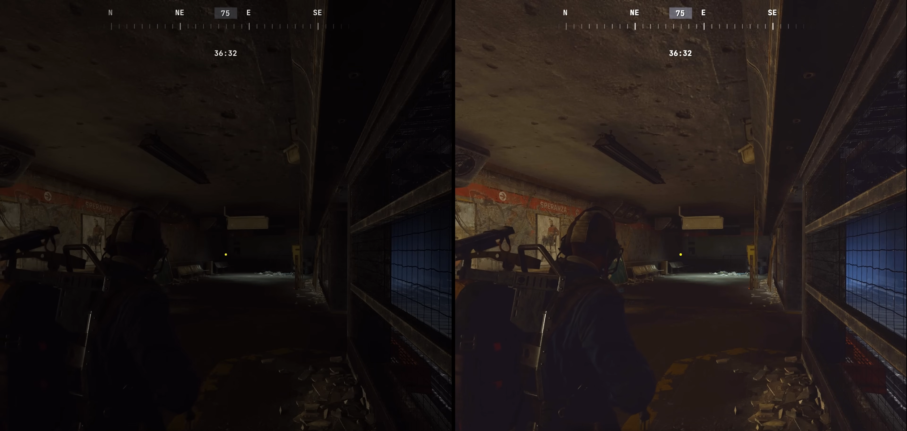

## Screenshots — V1.0

Two hero shots — the rest is one click away.

<table>
<tr>
  <td valign="top" width="40%">
    <strong>Tray menu</strong><br>
    Per-profile color marker, quick toggles for Alt-Tab Auto-Switch and Auto-Brightness, monitor picker, license status, one-click Settings.
    <br><br>
    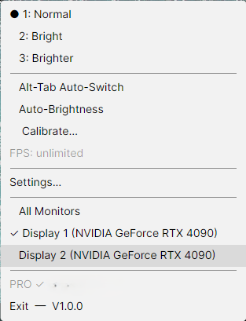
  </td>
  <td valign="top" width="60%">
    <strong>Map Scanner overlay — in-game</strong><br>
    Long-press M → ~100 % OCR hit rate, detects all 13 current map conditions, color-coded evac timers, audible alarm below threshold.
    <br><br>
    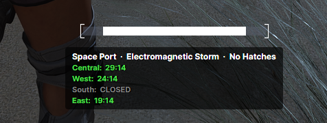
  </td>
</tr>
</table>

<details>
<summary><b>📸 See every Settings tab</b> (click to expand — 10 screenshots)</summary>

<br>

**Game Profiles — the Free killer feature.** Per-game profile + FPS limit, auto-switched on Alt-Tab.

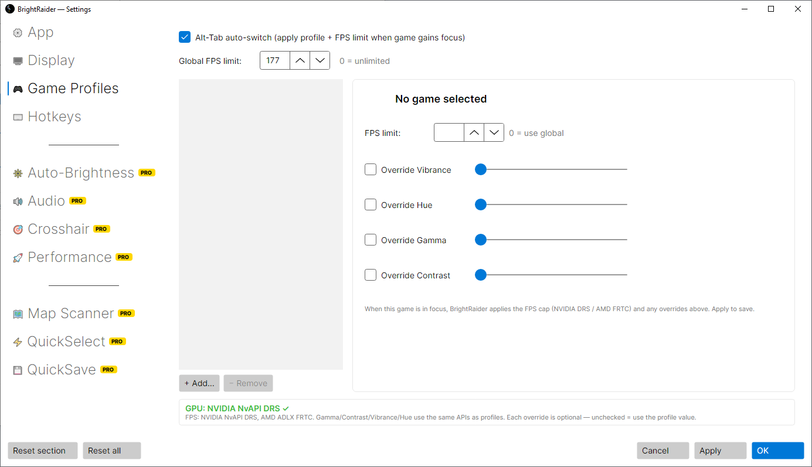

**Display + Profiles.** 9 profiles, each with Gamma / Contrast / Vibrance / Hue and an optional brightness range for Auto-Brightness.

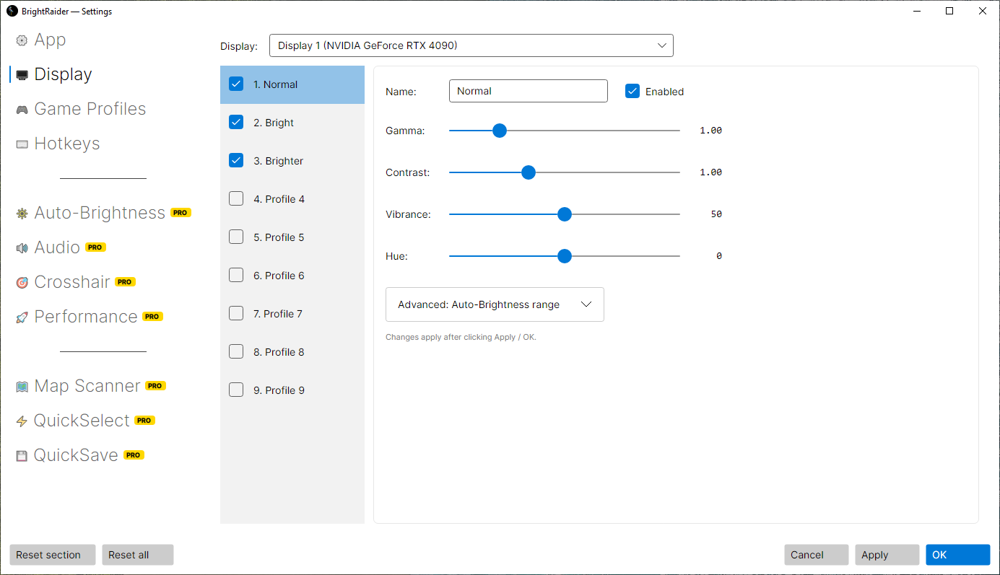

**Auto-Brightness (Pro).** 5-zone screen sampling, Calibration Wizard, optional debug overlay.

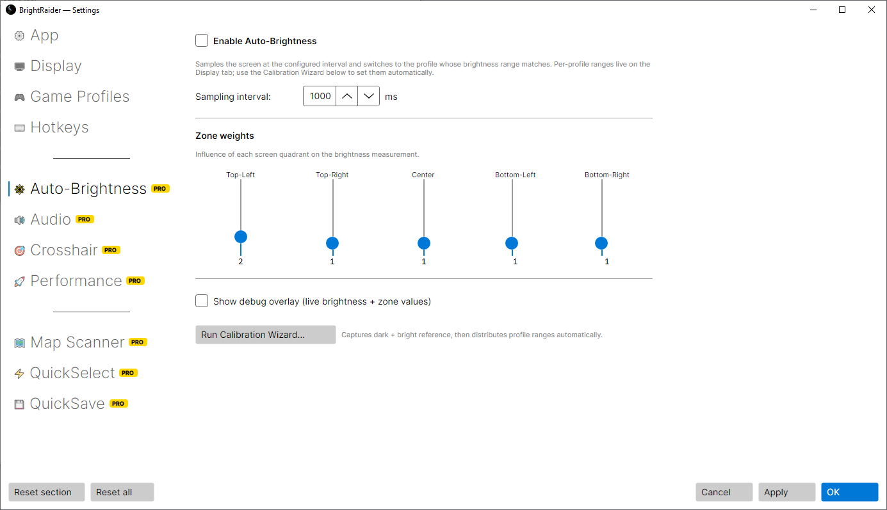

**Audio (Pro).** Footstep Booster (per-process limiter), Audio Ducking, Background AutoMute.

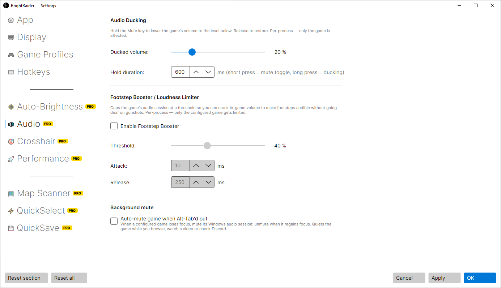

**Map Scanner (Pro).** Per-state threshold colors, overlay position + background opacity, Evac alarm threshold.

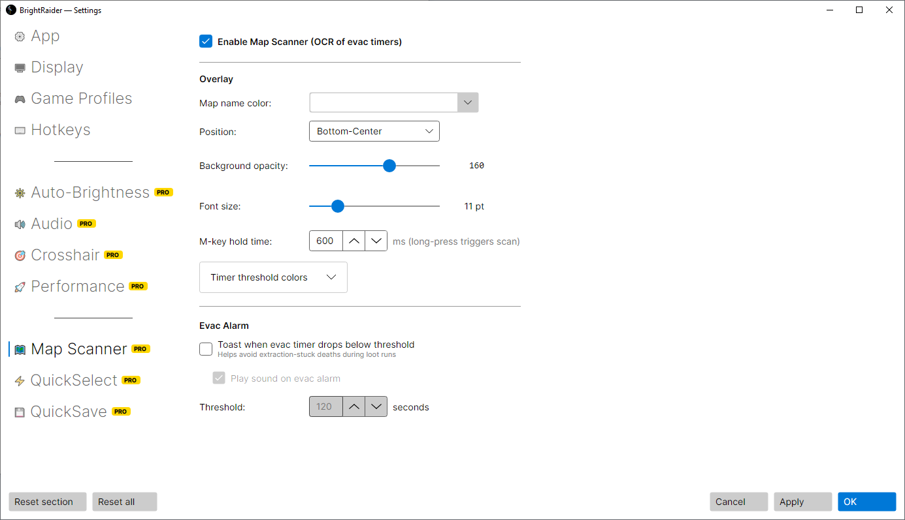

**Crosshair (Pro).** Click-through overlay, 6 styles, custom color + outline.

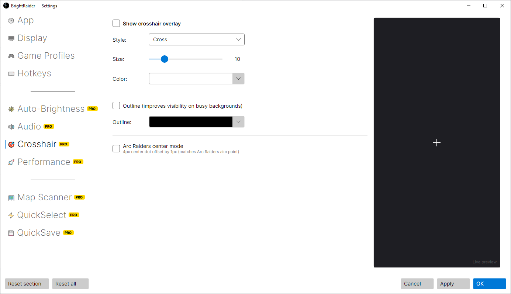

**QuickSelect (Pro).** 8 slots, per-slot LMB hold time (ms), modifier-key bindings, MB3/4/5 + wheel triggers.

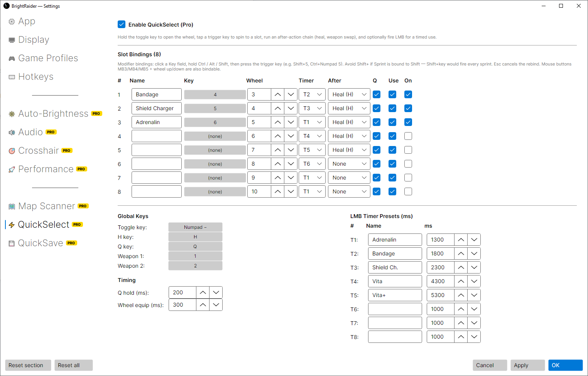

**QuickSave (Pro).** 5 drag presets, toggle direction, configurable timing.

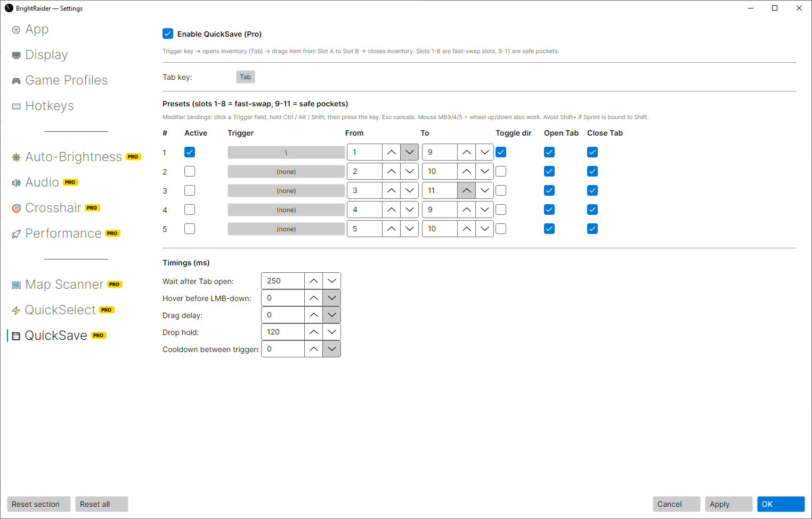

**Hotkeys.** Every key reassignable. Modifier-key support (Ctrl / Alt / Shift). Mouse MB3/4/5 + scroll wheel.

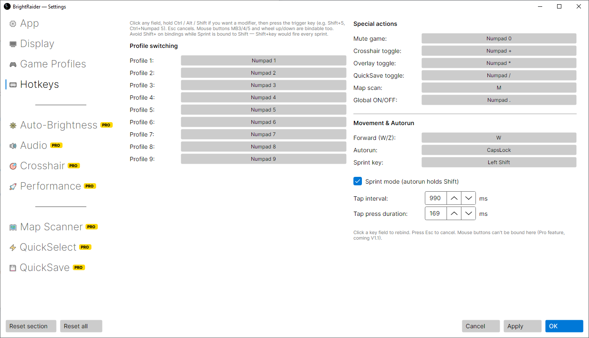

**App + Performance.** Theme, language, license, Break reminder, display-reset emergency buttons. Performance tab: optional High priority + physical-cores-only affinity for the foreground game.

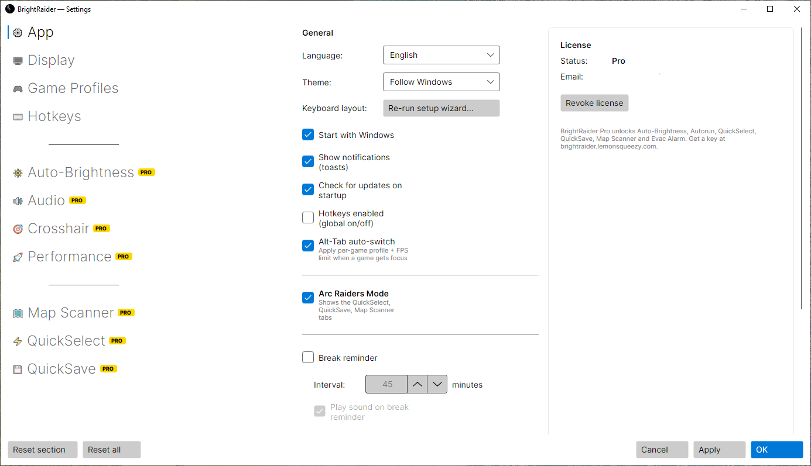
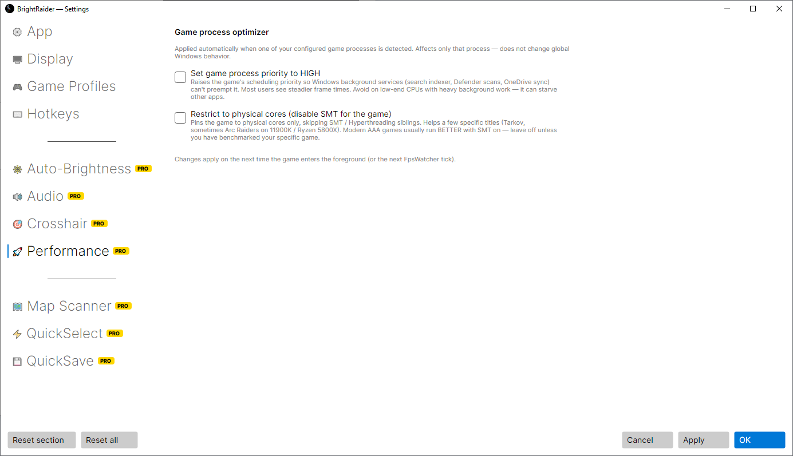

</details>

## Demo Videos

> **Note on video quality:** BrightRaider works by adjusting display output at the GPU level — the same way your monitor brightness works. Because of this, screen recording software cannot capture the actual brightness changes. The videos were recorded with a phone camera pointed at the monitor, which is why the quality is lower than usual. This is also proof that BrightRaider is not a cheat — it only changes display settings, nothing inside the game.

**Free version** — Profile switching with hotkeys (starts at 0:06):
[](https://youtu.be/ZjRZKfPi7Ok?t=6)

**Pro version** — Auto-Brightness in action:
[](https://youtu.be/q4DPRjHs24g?t=4)

## Why BrightRaider?

NVIDIA Game Filters are blocked by anti-cheat (EAC). Monitor OSD is slow and clunky. Alt-tabbing to adjust settings gets you killed.

BrightRaider's display and colour features use standard Windows display APIs — the same way your NVIDIA Control Panel or monitor settings work — and are **safe with all major anti-cheat systems** (EAC, BattlEye, Vanguard).

> **VibranceGUI is no longer needed.** BrightRaider V1.0 auto-switches vibrance and FPS limits per game as you alt-tab — everything VibranceGUI does, in one place. You can uninstall it.

> ⚠️ **Antivirus false positive?** Some AV tools flag BrightRaider due to its global keyboard hook (same mechanism as Logitech GHub, Razer Synapse, Discord Push-to-Talk). No data is logged or transmitted. 100–200 downloads daily, zero reports — [see stats](https://github-release-stats.ghostbyte.dev/BrightRaider/BrightRaider).

## Features

### Free
- **3 hotkey-switchable display presets** — Normal / Bright / Brighter, applied instantly with a keypress even in fullscreen. Editing the preset values is Pro; for fully custom colors per game use **Game Profiles** (below).
- **Game Profiles + Alt-Tab Auto-Switch** — fully customizable **per-game color overrides (Gamma / Contrast / Vibrance / Hue)** *and* a per-game FPS limit, applied automatically when the game enters the foreground and reverted to your original ramps on Alt-Tab out. This is the free way to tune colors per game — replaces VibranceGUI completely.
- **FPS Limit per game** — NVIDIA via NvAPI DRS, AMD via ADLX FRTC. Set Arc Raiders to 141, CS2 to unlimited — saved per profile. Saves GPU power, lowers fan noise. → [Optimal FPS cap settings (Blur Busters gsync 101)](https://blurbusters.com/gsync/gsync101-input-lag-tests-and-settings/)
- **Configurable hotkeys with modifier support** — every key reassignable, supports `Ctrl+5`, `Alt+F2`, `Shift+Numpad 3`, mouse MB3/4/5, scroll wheel. Setup wizard on first launch (Numpad / TKL / AZERTY). Optional **"only run hotkeys while a game is focused"** mode so BrightRaider's keys never interfere with normal typing on the desktop.
- **HDR toggle hotkey** — flip Windows HDR on/off with one key instead of digging through Windows Settings (especially painful on Windows 10). Works on the pinned monitor or all HDR-capable ones.
- **Original gamma persistence** — your DisplayCAL / ICC calibration is saved on first launch and restored on every exit. Survives crashes — V1.0 stores the baseline to disk, can't be poisoned by a force-kill.
- **Dark Mode** — full dark theme for the Settings window (Light / Dark / Follow OS in *Settings → App → Theme*).
- **NVIDIA + AMD + Intel** support (GDI fallback for any GPU)
- **Multi-monitor** support — apply to one specific display or all together
- **English / German** interface
- **Break Reminder** — configurable interval, optional audible cue, live toggle
- **Update notifier** in the tray menu
- **Auto-Start with Windows**
- **Native AOT** — no .NET runtime install needed, sub-second startup, single portable EXE

### Pro (€5.49)
- **Map Scanner** — long-press M on the in-game map → ~100 % OCR hit rate, detects all 13 current map conditions (Night Raid, Hurricane, Electromagnetic Storm, Harvester, Lush Blooms, Matriarch, Husk Graveyard, Close Scrutiny, Bird City, Locked Gate, Launch Tower Loot, Beachcombing, and the base no-event state). Color-coded timer overlay with per-state thresholds, configurable Evac alarm. 📖 [Setup Guide](docs/MapScanner_Guide.md)
- **Auto-Brightness** — 5-zone screen sampling smoothly interpolates Gamma/Contrast/Vibrance across enabled profiles. Calibration Wizard sets it up in two clicks. Optional debug overlay with live zone values. 📖 [Setup Guide](docs/AutoBrightness_Guide.md)
- **Footstep Booster** *(new in V1.0)* — per-process audio limiter so you can crank in-game volume to hear footsteps without going deaf on gunshots. Configurable threshold / attack / release. Per-game only — Discord, music, browser stay untouched. 📖 [Setup Guide](docs/FootstepBooster_Guide.md)
- **QuickSelect** — single keypress automatically uses an item from your quick-use wheel: hold Q → select slot → release Q → hold LMB → press H. 8 independent slots, per-slot LMB hold time in milliseconds, modifier-key bindings (`Ctrl+5`, `Shift+Numpad 3`), MB3/4/5 + scroll-wheel triggers. 📖 [Setup Guide](docs/QuickSelect_Guide.md)
- **QuickSave** — single keypress drags an item between inventory slots and Safe Pocket. Handles open → drag → close. 5 presets, configurable slots, optional toggle-direction. 📖 [Setup Guide](docs/QuickSave_Guide.md)
- **Crosshair Overlay** — click-through crosshair directly on screen. 6 styles (Cross, Dot+Ring, T-Shape, Dot, Ring, Cross-with-gap), custom color + outline (color **and** thickness), size 4–50 px. Same overlay mechanism as Discord and GeForce Experience.
- **Background AutoMute** *(new in V1.0)* — the game's Windows audio session is muted automatically when you Alt-Tab out, unmuted on focus return. Per-process — your music + Discord keep playing.
- **Audio Output Switcher** *(new in V1.0)* — switch your default output device (speakers ↔ headphones ↔ …) with one hotkey, cycling through the devices you pick. Optionally auto-switches to a chosen device when a game starts and restores the previous one when it closes — alt-tabbing out does **not** switch back. Switches the game/media device by default; an opt-in *"Also switch the communications device"* makes Discord/voice follow too (off by default so it can't disrupt voice apps like TeamSpeak).
- **Process Optimizer** *(new in V1.0)* — opt-in High process priority + physical-cores-only affinity (Hyperthreading off) for the foreground game. Smoother frametimes on cores fighting with background tasks.
- **Autorun** — short press CapsLock to hold the forward key. Tap Mode (hold CapsLock 600 ms) pulses forward — built for the Looting Mk. 3 (Survivor) augment, keeps health at 75 % while moving. AZERTY support (Z forward).
- **Audio Ducking** — hold the mute key 600 ms to duck game audio to a configurable %. Short press still mutes/unmutes.
- **Game Mute** — mute only the game's audio session, leaves Discord / music untouched.
- **Display profile editing + Profiles 4–9** — edit the built-in display presets directly (Gamma / Contrast / Vibrance / Hue) and unlock six more profile slots (4–9). On Free the three presets are switch-only.
- **Calibration Wizard** — two-step capture (darkest + brightest spot) distributes profiles across the range automatically

## Default Profiles

| Key (default) | Name | Gamma | Contrast | Vibrance |
|---------------|------|-------|----------|----------|
| Num 1 | Normal | 1.0 | 100% | 50% |
| Num 2 | Bright | 1.5 | 110% | 60% |
| Num 3 | Brighter | 2.0 | 110% | 70% |
| Num 4–9 | Custom [PRO] | Editable | Editable | Editable |

All hotkeys are rebindable. Defaults shown above use the numpad preset. On Free these three presets are **switch-only** — editing any display profile's values (and unlocking 4–9) is Pro. For fully custom colors per game, use the free **Game Profiles** tab.

## Download

**[Download Latest Release](../../releases/latest)**

| File | For |
|------|-----|
| `BrightRaider.exe` | All keyboards — numpad, TKL, or custom |

A short setup wizard appears on first launch: choose your keyboard type (numpad or TKL) and your hotkeys are configured automatically. You can re-run the wizard at any time from Settings → Input.

> **Previously released as two separate files** (`BrightRaider.exe` for numpad and `BrightRaider_Arrows.exe` for TKL keyboards). V1.0 combines both into one EXE with fully rebindable hotkeys.

Just download and run. No installation needed.

## Quick Start

1. Run `BrightRaider.exe` — a setup wizard appears
2. Choose your keyboard type (numpad or TKL) — defaults are configured automatically
3. Press your profile key — switch brightness instantly, even in fullscreen
4. That's it. Switch anytime.

## First Launch

On first launch, BrightRaider sets one registry entry to unlock gamma adjustment:

```
HKLM\SOFTWARE\Microsoft\Windows NT\CurrentVersion\ICM → GdiIcmGammaRange = 256
```

This tells Windows to allow gamma adjustments — used by many display calibration tools, harmless, can be removed anytime. A UAC prompt appears once. **Restart your PC after the first launch** (only needed once).

## Pro Activation

1. Buy your license:
   - **[Lemon Squeezy (€5.49)](https://brightraider.lemonsqueezy.com/checkout/buy/9b93d8c0-262f-43a4-bd41-167557efb156)**
2. Right-click tray icon → **Settings** → **Enter License**
3. Enter your email and license key
4. Done — all Pro features unlocked permanently. No subscription. Internet required once for activation, offline forever after.

## Hotkeys (default)

> All hotkeys are fully rebindable in **Settings → Input**.

| Numpad (default) | TKL (default) | Action | Version |
|------------------|---------------|--------|---------|
| Numpad 1–3 | ← ↓ → | Switch profile | Free |
| Numpad 4–9 | — | Switch profile (4–9) | Pro |
| Numpad 0 (short) | ↑ (short) | Mute/unmute game | Pro |
| Numpad 0 (hold 600ms) | ↑ (hold 600ms) | Audio Ducking on/off | Pro |
| Numpad + | Insert | Toggle crosshair | Pro |
| Numpad * | Delete | Toggle timer overlay | Pro |
| Numpad − | Home | Toggle QuickSelect on/off | Pro |
| Numpad / | End | Toggle QuickSave on/off | Pro |
| Numpad Del | Page Down | Toggle ALL hotkeys on/off | Pro |
| Numpad Enter | Page Up | Cycle audio output device | Pro |
| CapsLock | CapsLock | Toggle autorun | Pro |
| M (hold on map) | M (hold on map) | Scan evacuation timers | Pro |

Works with NumLock on or off. **Tip: keep NumLock off while playing** — with NumLock on, Windows briefly interrupts the Shift key when you switch profiles, which can slow your character if Shift is your sprint key.

## How It Works

BrightRaider adjusts your display output using standard Windows APIs:

- **GDI** (`SetDeviceGammaRamp`) — gamma & contrast, works on every GPU
- **NvAPI** — NVIDIA Digital Vibrance; per-game FPS limits via NvAPI DRS
- **ADL** — AMD Radeon saturation + hue control
- **ADLX** — AMD per-game FPS limits via ADLX FRTC

Nothing is modified in the game. Nothing is injected. It's the equivalent of changing your monitor brightness — just faster and with presets.

### Auto-Brightness (Pro)

Analyzes 5 small zones across your screen (center + 4 corners) using median brightness measurement. Based on the result, it smoothly interpolates between your profiles. Darker screen = more boost, brighter screen = less. The transition is seamless.

Calibrate in two steps: measure the darkest spot, measure the brightest spot, done.

## Anti-Cheat Safety

BrightRaider does **NOT**:
- Modify game files or memory
- Inject DLLs into game processes
- Hook into the game
- Read game data or game memory

The Map Scanner takes a **screenshot of your screen** and reads it on your PC — the same as taking a photo of your monitor. No game files, no game memory, no game process is accessed.

BrightRaider **ONLY** uses:
- Windows GDI — same as your monitor settings
- NVIDIA NvAPI — same as NVIDIA Control Panel
- AMD ADL / ADLX — same as AMD Radeon Software

Anti-cheat systems do not flag display adjustments.

### Input Automation

**Autorun** just holds your forward key down — a comfort feature, the same as the auto-run key many games include natively or a keyboard's own key-hold. It's a single held keypress with no timing pattern or sequence to it, effectively indistinguishable from holding the key yourself.

**QuickSave** and **QuickSelect** are the part to be aware of: they send a short sequence of clicks/keystrokes to move an item, so they're not in the "display only" category. BrightRaider does this with **no kernel driver and no injection** — but automated multi-step input is something behavioural anti-cheat (such as Anybrain, now used by Arc Raiders) can in principle flag, like any input-automation tool. The strongest thing such detection keys on is *simulated mouse movement*, so keyboard-only selection is a weaker signal than anything that moves the cursor for you. Both are **optional and off by default** — if you want zero exposure, leave them off and use everything else: display, FPS, overlay, Map Scanner and Autorun all stay clear of that category.

### Crosshair Overlay

BrightRaider's crosshair works via a transparent Windows overlay — the exact same mechanism used by Discord, GeForce Experience, and TeamSpeak overlays.

EAC (Easy Anti-Cheat) **explicitly allows** this type of overlay. It is not injected into the game, does not read game memory, and is not rendered inside the game engine. It is simply a transparent window drawn on top by Windows.

EAC-safe — no injection, no game memory access, no rendering inside the engine.

## System Requirements

- Windows 10 / 11 (x64)
- **No .NET runtime install required** — V1.0 is Native AOT, single self-contained EXE
- NVIDIA or AMD GPU recommended for full feature set (Vibrance, Hue, FPS limit). Intel + integrated GPUs work with Gamma + Contrast only.

## Changelog

**[View full changelog](docs/CHANGELOG_PUBLIC.txt)**

## Manual

**📘 [Full Manual](docs/Manual.txt)** — English + German, every feature explained.

## Guides

Deep-dives for the more advanced features:

- 🗺️ **[Map Scanner Guide](docs/MapScanner_Guide.md)** — supported maps, event detection (all 13 conditions), threshold colors, Evac alarm setup
- 🔆 **[Auto-Brightness Guide](docs/AutoBrightness_Guide.md)** — how the 5-zone sampler works, Calibration Wizard walkthrough, zone-weight tuning, debug overlay
- 🔊 **[Footstep Booster Guide](docs/FootstepBooster_Guide.md)** — threshold / attack / release tuning, recommended starting values, troubleshooting
- ⚡ **[QuickSelect Guide](docs/QuickSelect_Guide.md)** — per-slot LMB hold time, modifier-key bindings, slots 7–10 mouse-movement path
- 💾 **[QuickSave Guide](docs/QuickSave_Guide.md)** — 5 drag presets, toggle direction, timing controls

## Uninstall

1. Exit BrightRaider (right-click tray → Exit)
2. Delete the folder
3. Optional: Remove `GdiIcmGammaRange` from `HKLM\...\ICM`
4. Optional: Remove auto-start from `HKCU\SOFTWARE\Microsoft\Windows\CurrentVersion\Run`

## Feedback & Issues

Found a bug or have an idea? [Open an issue](https://github.com/BrightRaider/BrightRaider/issues/new/choose).

> This is a solo hobby project maintained in my free time. I read everything, but response times vary — there is no support contract.

## FAQ

**Does this work with other games?**
Yes. BrightRaider adjusts your display, not the game.

**Will I get banned?**
The display, colour, FPS and overlay features use the same Windows display APIs as your monitor settings — nothing injected, hooked, or read from the game — so they're anti-cheat-safe. The optional input-automation features (QuickSave / QuickSelect / Autorun) send keystrokes to the game, which is a different category; in titles with behavioural anti-cheat (e.g. Arc Raiders' Anybrain) use those at your own discretion.

**Do I need Pro?**
Free is fully functional. Pro adds QuickSave (drag to Safe Pocket with one key), QuickSelect (auto-use items), auto-brightness, map scanner, and more — so you never take your hand off the mouse.

**I used VibranceGUI before. Do I still need it?**
No. BrightRaider V1.0 replaces it completely. Set your vibrance per game in Settings → Alt-Tab, and BrightRaider handles switching automatically.

---

<details>
<summary><strong>Deutsche Version</strong></summary>

## BrightRaider

**Feinde im Dunkeln sehen. Kein Alt-Tab, keine Spieldateien verändert.**

BrightRaider ist ein schlankes Windows-Tray-Tool, mit dem du Helligkeit, Kontrast und Digital Vibrance per Tastendruck umschalten kannst. Entwickelt für Arc Raiders Spieler, die in dunklen Höhlen und Schatten nichts sehen — funktioniert aber mit jedem Spiel.

Eine EXE, keine Abhängigkeiten, ~21 MB (Native AOT — keine .NET-Runtime-Installation nötig). Funktioniert mit jeder Tastatur — Numpad, TKL oder komplett selbst belegt.

## Warum BrightRaider?

NVIDIA Game Filter werden vom Anti-Cheat (EAC) blockiert. Das Monitor-OSD ist langsam und umständlich. Alt-Tab zum Einstellen bringt dich um.

BrightRaiders Anzeige- und Farbfunktionen nutzen Standard-Windows-Display-APIs — genau wie dein NVIDIA Control Panel oder deine Monitor-Einstellungen — und sind **sicher mit allen großen Anti-Cheat-Systemen** (EAC, BattlEye, Vanguard).

> **VibranceGUI wird nicht mehr benötigt.** BrightRaider V1.0 schaltet Vibrance und FPS-Limit automatisch pro Spiel beim Alt-Tab — alles was VibranceGUI macht, an einem Ort. Du kannst es deinstallieren.

## Features

### Free
- **3 Helligkeitsprofile** — Normal, Hell, Heller
- **Sofortiges Umschalten per Hotkey** — funktioniert im Vollbild
- **Gamma + Kontrast + Digital Vibrance** Steuerung
- **FPS-Limit pro Spiel** — einmal einstellen, BrightRaider schaltet automatisch beim Alt-Tab um. Arc Raiders auf Monitor-Hz begrenzen, CS2 unlimitiert lassen. Reduziert GPU-Leistungsaufnahme und Wärmeentwicklung spürbar — leiser, kühler. → [Optimale FPS-Cap-Einstellungen (Blur Busters gsync 101)](https://blurbusters.com/gsync/gsync101-input-lag-tests-and-settings/)
- **Automatisches Vibrance-Switching** — Spiel im Fokus → Gaming-Vibrance. Alt-Tab → normale Desktop-Vibrance. Ersetzt VibranceGUI vollständig.
- **Belegbare Hotkeys** — alle Tasten in Einstellungen → Input konfigurierbar. Funktioniert mit Numpad, TKL, QWERTZ, AZERTY — jede Tastatur.
- **HDR-Schalter per Hotkey** — Windows-HDR mit einer Taste an/aus, statt jedes Mal durch die Windows-Einstellungen zu klicken (unter Windows 10 besonders umständlich).
- **NVIDIA + AMD + Intel** Unterstützung (GDI-Fallback für jede GPU)
- **Multi-Monitor** Unterstützung
- **Englisch / Deutsch** Oberfläche
- **Pausen-Erinnerung** — zeigt nach einem konfigurierbaren Intervall einen orangen Toast (Standard: 45 Min). Unterbricht das Spiel nicht.
- **Autostart mit Windows**
- Portabel — keine Installation, nur eine EXE

### Pro (5,49 €)
- **QuickSave** — ein Tastendruck zieht ein Item aus dem Inventar in die Sicherheitstasche (oder zurück). Alles automatisch: Inventar öffnen → ziehen → schließen. 5 unabhängige Presets, Slots konfigurierbar. 📖 [Anleitung](docs/QuickSave_Guide.md)
- **QuickSelect** — eine Taste drücken, um ein Item aus dem Schnellrad automatisch zu benutzen. Q halten → Slot wählen → Q loslassen → LMB halten → H drücken. 8 Slots, LMB-Haltezeit in Millisekunden pro Slot, alle Tasten frei belegbar. 📖 [Anleitung](docs/QuickSelect_Guide.md)
- **Auto-Helligkeit** — passt sich automatisch an den Bildschirminhalt an. Dunkler Bereich? Helligkeit geht hoch. Draußen? Zurück auf Normal. Sanfte Übergänge, kein Ruckeln.
- **Map Scanner** — M auf der Karte gedrückt halten, um alle Evakuierungs-Timer automatisch auszulesen. Screenshot → lokale Auswertung auf deinem PC → farbkodierter Live-Countdown. Erkennt aktive Events (Nacht, Hurrikan, Elektr. Sturm). Unterstützt Buried City, Stella Montis, Space Port, Blue Gate, Damm und Riven Tides.
- **Evac-Alarm** — roter Toast + Sound wenn ein Evac-Timer unter den konfigurierten Schwellwert fällt.
- **Autorun** — kurz CapsLock drücken um die Vorwärtstaste zu halten. 600ms halten für Tap-Modus (ideal für Looting Mk. 3). Vorwärtstaste frei belegbar — funktioniert mit QWERTZ, AZERTY usw.
- **Crosshair-Overlay** — Click-through Fadenkreuz direkt auf dem Bildschirm. 6 Stile. EAC-sicher.
- **Audio Ducking** — Mute-Taste 600ms halten um Spiel-Audio auf 20% zu reduzieren.
- **Game Mute** — nur das Spiel stumm schalten. Discord, Musik, alles andere bleibt an.
- **Audio-Ausgabe-Switcher** *(neu in V1.0)* — Standard-Ausgabegerät per Hotkey umschalten (Boxen ↔ Kopfhörer ↔ …), du wählst frei aus, welche Geräte durchrotiert werden. Optional automatischer Wechsel beim Spielstart und Rückkehr zum vorherigen Gerät beim Spiel-Ende — Alt-Tab schaltet **nicht** zurück. Schaltet standardmäßig nur das Spiel-/Medien-Gerät; per Opt-in *„Also switch the communications device"* folgt auch Discord/Voice (ab Werk aus, damit Voice-Apps wie TeamSpeak nicht gestört werden).
- **Hue pro Profil** — Farbtemperatur pro Profil neben Vibrance. NVIDIA 0–359° wie im Control Panel, AMD im Treiber-Bereich.
- **Bis zu 9 Profile** mit voller Anpassung
- **Kalibrierungs-Assistent** — zwei Klicks für die Auto-Helligkeit
- **Profil-Editor** — Gamma, Kontrast, Vibrance, Hue pro Profil feintunen

## Download

**[Neueste Version herunterladen](../../releases/latest)**

| Datei | Für |
|-------|-----|
| `BrightRaider.exe` | Alle Tastaturen — Numpad, TKL oder eigene Belegung |

Beim ersten Start erscheint ein kurzer Einrichtungsassistent: Tastaturtyp wählen, Hotkeys werden automatisch gesetzt. Jederzeit neu starten über Einstellungen → Input.

> **Früher als zwei separate Dateien** (`BrightRaider.exe` für Numpad, `BrightRaider_Arrows.exe` für TKL). V1.0 vereint beide in einer EXE mit frei belegbaren Hotkeys.

## Tastenbelegung (Standard)

> Alle Hotkeys sind in **Einstellungen → Input** vollständig belegbar.

| Numpad (Standard) | TKL (Standard) | Aktion | Version |
|-------------------|----------------|--------|---------|
| Numpad 1–3 | ← ↓ → | Profil wechseln | Free |
| Numpad 4–9 | — | Profil wechseln (4–9) | Pro |
| Numpad 0 (kurz) | ↑ (kurz) | Spiel stumm/laut | Pro |
| Numpad 0 (600ms) | ↑ (600ms) | Audio Ducking an/aus | Pro |
| Numpad + | Einfg | Fadenkreuz an/aus | Pro |
| Numpad * | Entf | Timer-Overlay an/aus | Pro |
| Numpad − | Pos1 | QuickSelect an/aus | Pro |
| Numpad / | Ende | QuickSave an/aus | Pro |
| Numpad Entf | Bild↓ | ALLE Hotkeys an/aus | Pro |
| Numpad Enter | Bild↑ | Audio-Ausgabegerät umschalten | Pro |
| CapsLock | CapsLock | Autorun an/aus | Pro |
| M (halten auf Karte) | M (halten auf Karte) | Evakuierungs-Timer scannen | Pro |

## Anti-Cheat Sicherheit

BrightRaider verändert **KEINE** Spieldateien oder den Spielspeicher. Der Map Scanner macht einen Screenshot und liest ihn lokal auf deinem PC aus. Keine Injektion, kein Spielzugriff.

BrightRaider nutzt **NUR** Standard-Windows-APIs (GDI, NvAPI, ADL/ADLX) — wie das NVIDIA Control Panel oder AMD Radeon Software.

**Autorun** hält einfach deine Vorwärtstaste gedrückt — eine Komfort-Funktion, wie die Auto-Run-Taste, die viele Spiele nativ haben, oder die Tastenhalte-Funktion mancher Tastaturen. Ein einzelner gehaltener Tastendruck, ohne Timing-Muster oder Sequenz — praktisch nicht davon zu unterscheiden, dass du die Taste selbst hältst.

**QuickSave und QuickSelect** sind der Teil, den man kennen sollte: Sie senden eine kurze Folge von Klicks/Tastendrücken, um ein Item zu bewegen, und sind damit eine andere Kategorie als die Anzeige-Funktionen oben. BrightRaider macht das **ohne Kernel-Treiber und ohne Injektion** — automatisierte mehrstufige Eingaben können von verhaltensbasiertem Anti-Cheat (z. B. Anybrain, jetzt in Arc Raiders) aber grundsätzlich erkannt werden, wie bei jedem Eingabe-Automatisierungs-Tool. Das stärkste Signal für solche Systeme ist *simulierte Mausbewegung* — reine Tastatur-Auswahl ist daher ein schwächeres Signal als alles, was den Cursor für dich bewegt. Beide sind **optional und standardmäßig aus** — wer kein Risiko eingehen will, lässt sie aus und nutzt alles andere: Anzeige, FPS, Overlay, Map Scanner und Autorun bleiben außerhalb dieser Kategorie.

## FAQ

**Funktioniert das auch mit anderen Spielen?**
Ja. BrightRaider passt den Bildschirm an, nicht das Spiel.

**Werde ich gebannt?**
Die Anzeige-, Farb-, FPS- und Overlay-Funktionen nutzen die gleichen Windows-Display-APIs wie deine Monitor-Einstellungen — nichts wird injiziert, gehookt oder aus dem Spiel gelesen — sie sind also anti-cheat-sicher. Die optionalen Eingabe-Automatisierungs-Funktionen (QuickSave / QuickSelect / Autorun) senden Tastendrücke ans Spiel, das ist eine andere Kategorie; in Titeln mit verhaltensbasiertem Anti-Cheat (z. B. Arc Raiders' Anybrain) nutze diese nach eigenem Ermessen.

**Brauche ich Pro?**
Free ist voll funktionsfähig. Pro fügt QuickSave, QuickSelect, Auto-Helligkeit, Map Scanner und mehr hinzu.

**Ich hatte VibranceGUI. Brauche ich das noch?**
Nein. BrightRaider V1.0 ersetzt es vollständig. Vibrance und FPS-Limit pro Spiel in Einstellungen → Alt-Tab einstellen, BrightRaider übernimmt den Rest.

</details>

---

Made for the Arc Raiders community.
